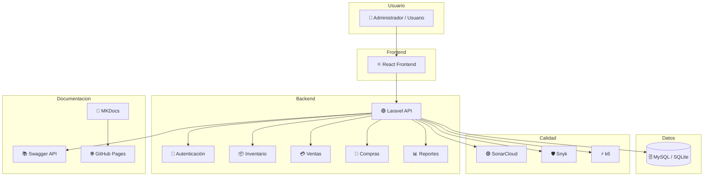
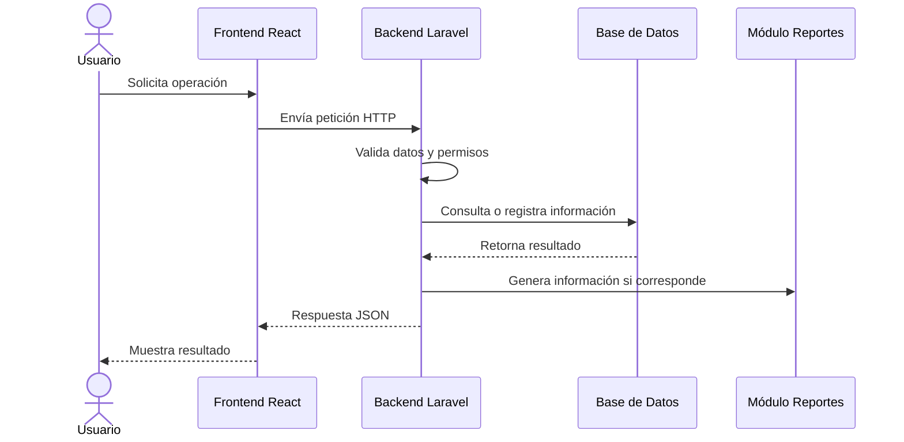

# 🏛 Arquitectura General del Sistema

## 📌 Visión General

La arquitectura de **Tridente Store** está diseñada bajo un enfoque **cliente-servidor**, separando la interfaz de usuario, la lógica de negocio y la persistencia de datos.

Esta separación permite que el sistema sea más organizado, mantenible, escalable y seguro.

---

## 🎯 Objetivos de la arquitectura

- Separar responsabilidades entre frontend, backend y base de datos.
- Facilitar el mantenimiento del código.
- Permitir el crecimiento futuro del sistema.
- Mejorar la seguridad mediante control de acceso.
- Centralizar la lógica de negocio en el backend.
- Documentar la API mediante Swagger.
- Integrar herramientas de calidad como SonarCloud y Snyk.

---

## 🏗 Vista general de arquitectura

---

## 🧱 Capas principales

| Capa | Tecnología | Responsabilidad |
|---|---|---|
| Presentación | React | Interfaz de usuario |
| Aplicación | Laravel | Controladores, rutas, validaciones y lógica |
| Dominio | Modelos Laravel | Entidades del negocio |
| Persistencia | MySQL / SQLite | Almacenamiento de datos |
| Documentación | Swagger / MKDocs | API y documentación técnica |
| Calidad | SonarCloud / Snyk / k6 | Análisis, seguridad y rendimiento |

---

## 🧩 Módulos principales

<h3>🔐 Usuarios y roles</h3>

Gestiona autenticación, autorización, roles y permisos.

<h3>📦 Productos</h3>

Administra productos, categorías y control de stock.

<h3>👥 Clientes</h3>

Registra y mantiene información de clientes.

<h3>🚚 Proveedores</h3>

Administra proveedores asociados a las compras.

<h3>💳 Ventas</h3>

Registra ventas y actualiza inventario automáticamente.

<h3>🛒 Compras</h3>

Registra compras y aumenta el stock disponible.

<h3>📊 Reportes</h3>

Genera reportes de ventas, compras e inventario.

<h3>🧪 Calidad</h3>

Integra SonarCloud, Snyk y k6 para evaluar el sistema.

---

## 🔄 Flujo general del sistema

---

## ✅ Beneficios arquitectónicos

| Beneficio | Descripción |
|---|---|
| Escalabilidad | Permite agregar nuevos módulos sin afectar todo el sistema. |
| Mantenibilidad | La separación por capas facilita correcciones y mejoras. |
| Seguridad | El backend centraliza autenticación, roles y permisos. |
| Trazabilidad | Las operaciones comerciales quedan registradas. |
| Calidad | Las herramientas de análisis permiten detectar mejoras. |
| Documentación | Swagger y MKDocs facilitan comprensión y mantenimiento. |

---

## 📦 Resultado

La arquitectura general de **Tridente Store** permite construir un sistema comercial modular, seguro y mantenible, preparado para crecer e integrarse con herramientas modernas de desarrollo, documentación y calidad.