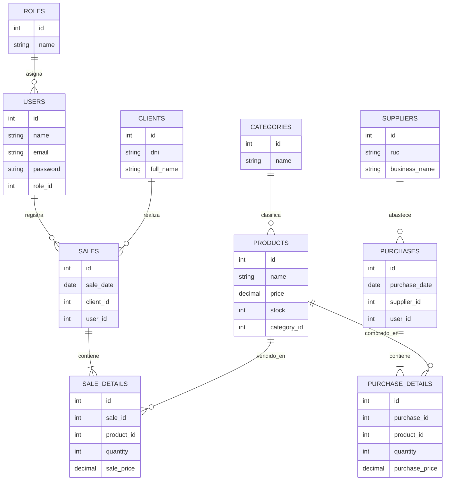
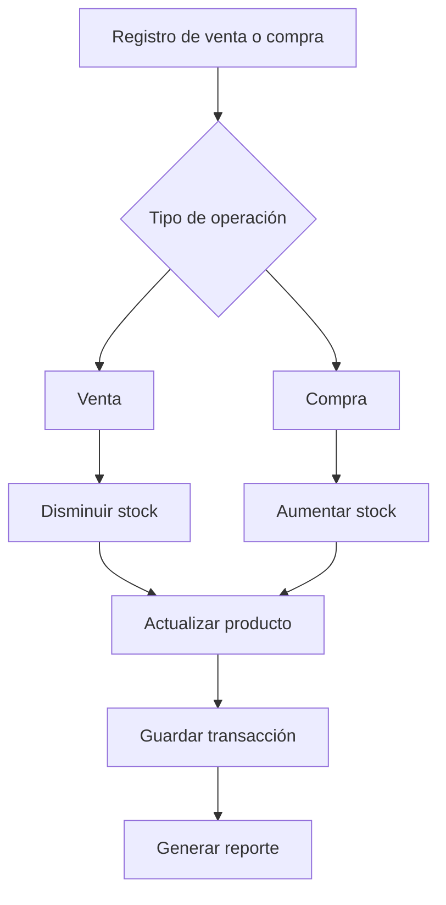

# 🗄 Arquitectura de Base de Datos

## 📌 Visión general

La base de datos de **Tridente Store** permite almacenar y relacionar la información principal del sistema: usuarios, roles, productos, categorías, clientes, proveedores, ventas, compras e inventario.

El diseño busca garantizar integridad, trazabilidad y consistencia en las operaciones comerciales.

---

## 🧱 Entidades principales

| Entidad | Descripción |
|---|---|
| Usuarios | Almacena los usuarios que acceden al sistema. |
| Roles | Define el nivel de acceso de cada usuario. |
| Productos | Registra los productos disponibles para venta. |
| Categorías | Clasifica los productos. |
| Clientes | Almacena información de los clientes. |
| Proveedores | Registra proveedores asociados a compras. |
| Ventas | Registra transacciones de salida de productos. |
| Detalle de venta | Guarda los productos vendidos por transacción. |
| Compras | Registra ingreso de productos al inventario. |
| Detalle de compra | Guarda productos adquiridos en cada compra. |

---

## 🏗 Diagrama Entidad - Relación

---

## 🔄 Flujo de actualización de stock

---

## 🔐 Integridad de datos

| Regla | Aplicación |
|---|---|
| Claves primarias | Identifican cada registro de forma única. |
| Claves foráneas | Relacionan ventas, compras, productos, clientes y proveedores. |
| Validación de stock | Evita ventas con productos insuficientes. |
| Transacciones | Garantizan consistencia al registrar ventas o compras. |
| Historial | Permite trazabilidad de operaciones comerciales. |

---

## 📊 Beneficios del diseño

- Control de inventario en tiempo real.
- Trazabilidad de ventas y compras.
- Organización de productos por categorías.
- Relación entre clientes, proveedores y transacciones.
- Reducción de errores manuales.
- Información confiable para reportes.

---

!!! success "Conclusión"

    La arquitectura de base de datos permite que **Tridente Store** mantenga información organizada, consistente y confiable para la gestión comercial.