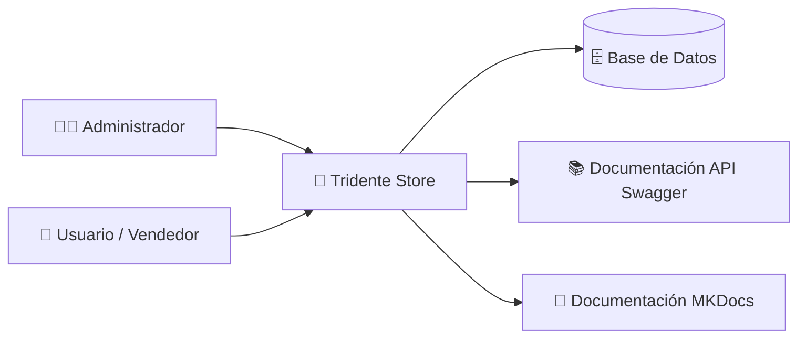
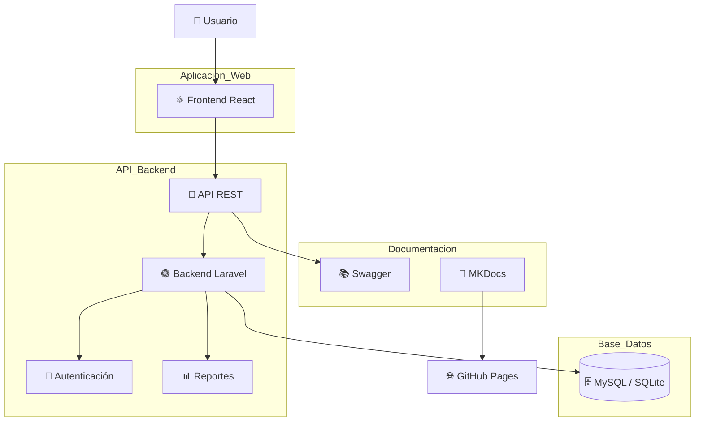
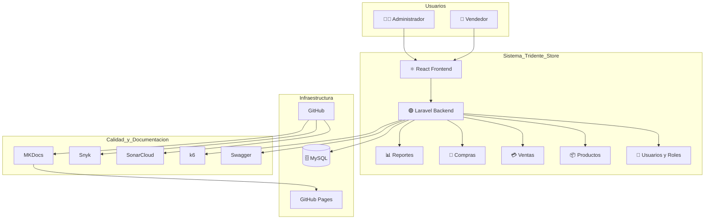

# 🧱 Modelo C4 - Tridente Store

## 📌 ¿Qué es el Modelo C4?

El modelo C4 permite representar la arquitectura de un sistema desde diferentes niveles de detalle. Para **Tridente Store**, se utilizarán dos vistas principales:

- **Nivel 1 - Contexto:** muestra quién usa el sistema y con qué elementos externos interactúa.
- **Nivel 2 - Contenedores:** muestra cómo está dividido técnicamente el sistema.

---

# 🌐 C4 Nivel 1 - Diagrama de Contexto

Este nivel muestra la relación entre los usuarios principales y el sistema **Tridente Store**.

---

## 👥 Actores principales

| Actor | Descripción |
|---|---|
| Administrador | Gestiona usuarios, roles, reportes y configuración del sistema. |
| Usuario / Vendedor | Registra ventas, compras, productos, clientes y proveedores. |
| Sistema Tridente Store | Plataforma central para la gestión comercial. |
| Base de Datos | Almacena información de usuarios, productos, ventas, compras e inventario. |
| Swagger | Documenta los endpoints de la API REST. |
| MKDocs | Presenta la documentación técnica del proyecto. |

---

# 🧩 C4 Nivel 2 - Diagrama de Contenedores

Este nivel muestra la separación técnica del sistema en contenedores principales.

---

## 📦 Contenedores identificados

| Contenedor | Tecnología | Responsabilidad |
|---|---|---|
| Frontend Web | React | Interfaz visual e interacción con el usuario. |
| Backend API | Laravel | Procesamiento de solicitudes, reglas de negocio y seguridad. |
| Base de Datos | MySQL / SQLite | Persistencia de datos del sistema. |
| Swagger | OpenAPI | Documentación técnica de los endpoints. |
| MKDocs | Material for MKDocs | Documentación web del proyecto. |
| GitHub Pages | GitHub | Publicación de la documentación en la nube. |

---

# 🏗 Vista C4 extendida

---

# ✅ Resultado

El modelo C4 permite comprender la arquitectura de **Tridente Store** desde una vista general hasta una vista técnica, evidenciando la separación entre usuarios, frontend, backend, base de datos, documentación y herramientas de calidad.