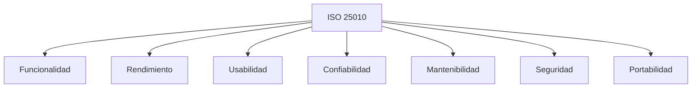
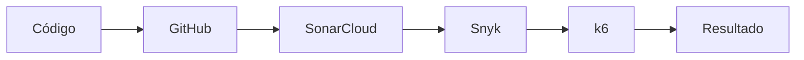
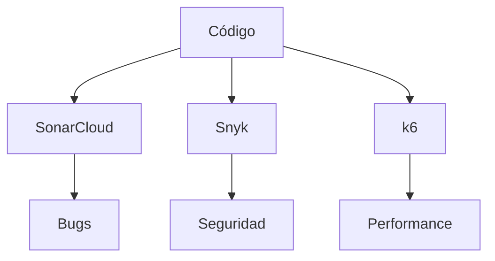

# 📊 Calidad del Software

## 📌 Introducción

La calidad del software desarrollado en **Tridente Store** fue evaluada considerando los atributos definidos por la norma **ISO/IEC 25010**, además de herramientas automáticas para análisis estático, seguridad y rendimiento.

---

# 🏛 Modelo de Calidad

---

# Herramientas utilizadas

| Herramienta | Objetivo |
|-------------|----------|
| SonarCloud | Calidad del código |
| Snyk | Seguridad |
| k6 | Rendimiento |
| GitHub | Versionamiento |
| Swagger | API |
| MKDocs | Documentación |

---

# Flujo de Calidad

---

# Métricas evaluadas

| Métrica | Estado |
|----------|--------|
| Bugs | ✅ |
| Vulnerabilidades | ✅ |
| Code Smells | ✅ |
| Duplicación | ✅ |
| Cobertura | ✅ |
| Rendimiento | ✅ |

---

# Evaluación ISO 25010

| Característica | Evaluación |
|----------------|------------|
| Funcionalidad | Excelente |
| Confiabilidad | Muy Buena |
| Rendimiento | Muy Bueno |
| Usabilidad | Excelente |
| Seguridad | Muy Buena |
| Mantenibilidad | Excelente |
| Compatibilidad | Muy Buena |

---

# Arquitectura de Calidad

---

!!! success "Resultado"

La aplicación cumple con los criterios principales de calidad establecidos por ISO/IEC 25010 y fue apoyada por herramientas automáticas para asegurar la mantenibilidad, seguridad y rendimiento.