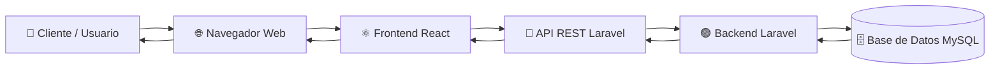
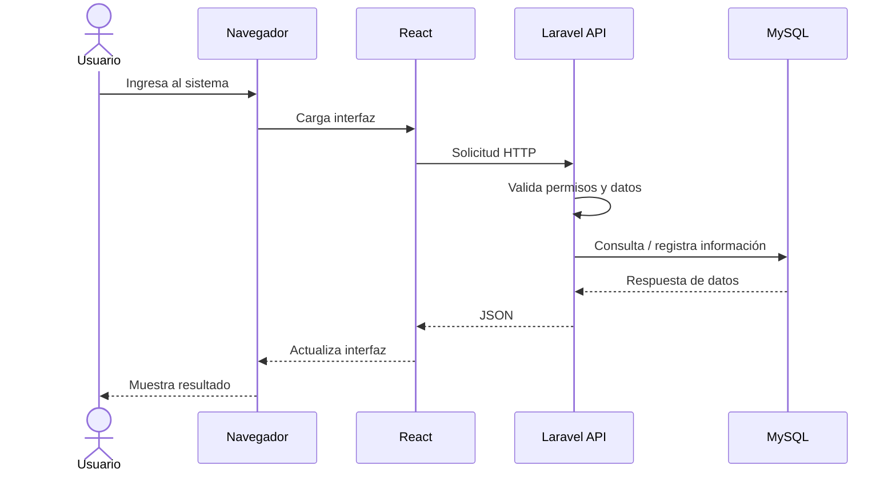
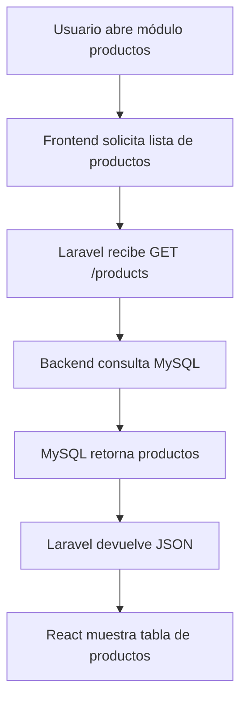

# 🌐 Arquitectura Cliente - Servidor

## 📌 Visión general

**Tridente Store** utiliza una arquitectura **cliente-servidor**, donde el cliente solicita servicios mediante la interfaz web y el servidor procesa la lógica de negocio, gestiona la información y responde con los datos necesarios.

Esta arquitectura permite separar la presentación del procesamiento interno del sistema.

---

## 🏗 Diagrama Cliente - Servidor

---

## 📦 Componentes principales

| Elemento | Rol en la arquitectura |
|---|---|
| Usuario | Interactúa con el sistema desde el navegador. |
| Navegador | Ejecuta la interfaz web. |
| Frontend React | Presenta formularios, tablas, reportes y pantallas. |
| API REST Laravel | Recibe solicitudes HTTP y devuelve respuestas JSON. |
| Backend Laravel | Procesa reglas de negocio, validaciones y seguridad. |
| Base de Datos MySQL | Almacena la información del sistema. |

---

## 🔄 Flujo de solicitud

---

## 🛠 Métodos HTTP utilizados

| Método | Uso |
|---|---|
| GET | Consultar información, listar productos, clientes o reportes. |
| POST | Registrar nuevos usuarios, productos, ventas o compras. |
| PUT/PATCH | Actualizar información existente. |
| DELETE | Eliminar o desactivar registros. |

---

## 📊 Ejemplo aplicado: consulta de productos

---

## ✅ Ventajas para Tridente Store

- Separa la interfaz del procesamiento.
- Facilita el mantenimiento.
- Permite reutilizar la API.
- Mejora la escalabilidad.
- Centraliza la seguridad en el backend.
- Permite integración con Swagger y pruebas de API.
- Facilita el despliegue del frontend y backend por separado.

---

!!! success "Conclusión"

    La arquitectura cliente-servidor permite que **Tridente Store** funcione como una plataforma web moderna, donde React gestiona la experiencia del usuario y Laravel procesa las reglas de negocio conectadas a la base de datos.