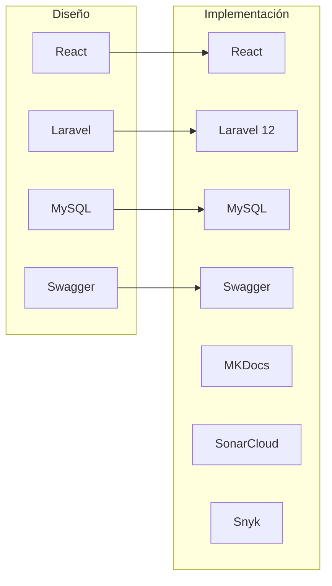
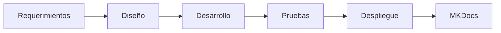

# ⚖️ Comparación entre la Arquitectura Diseñada e Implementada

## 📌 Introducción

Durante la fase de diseño se definió una arquitectura basada en el modelo Cliente-Servidor, utilizando React para la interfaz de usuario, Laravel como backend y MySQL como sistema gestor de base de datos.

En la implementación final, dicha arquitectura se mantuvo, incorporando además herramientas para documentación, calidad y seguridad del software.

---

# 🏛 Comparación General

| Aspecto | Arquitectura Diseñada | Arquitectura Implementada | Estado |
|-----------|-----------------------|----------------------------|:------:|
| Frontend | React | React | ✅ |
| Backend | Laravel | Laravel 12 | ✅ |
| Base de Datos | MySQL | MySQL / SQLite | ✅ |
| API REST | Laravel API | Laravel API + Swagger | ✅ |
| Documentación | MKDocs | MKDocs Material | ✅ |
| Versionamiento | Git | Git + GitHub | ✅ |
| Calidad | SonarCloud | SonarCloud | ✅ |
| Seguridad | Snyk | Snyk | ✅ |
| Pruebas | k6 | k6 | ✅ |

---

# 🏗 Comparación Arquitectónica

---

# 📊 Evolución de la Arquitectura

---

# 🔍 Cambios realizados

| Cambio | Motivo | Beneficio |
|----------|---------|-----------|
| Integración de Swagger | Documentar API | Facilita el consumo de servicios |
| Incorporación de SonarCloud | Calidad del código | Reduce errores |
| Incorporación de Snyk | Seguridad | Detecta vulnerabilidades |
| Implementación de MKDocs | Documentación | Mejor organización |
| GitHub Pages | Publicación | Acceso web a la documentación |

---

# 📈 Beneficios obtenidos

<h3>🏗 Mejor Arquitectura</h3>

Separación clara entre frontend, backend y base de datos.

<h3>📚 Documentación</h3>

API y documentación técnica centralizadas.

<h3>🔐 Seguridad</h3>

Análisis automático de vulnerabilidades.

<h3>📊 Calidad</h3>

Evaluación continua mediante SonarCloud.

---

# 📋 Evaluación Final

| Criterio | Cumplimiento |
|-----------|--------------|
| Arquitectura Cliente - Servidor | ✅ |
| Arquitectura MVC | ✅ |
| Modelo C4 | ✅ |
| API REST | ✅ |
| Seguridad | ✅ |
| Calidad | ✅ |
| Documentación | ✅ |
| DevOps | ✅ |

---

!!! success "Conclusión"

    La arquitectura implementada mantiene los principios definidos durante la fase de diseño e incorpora herramientas modernas de documentación, calidad y seguridad que fortalecen la mantenibilidad y escalabilidad del sistema.