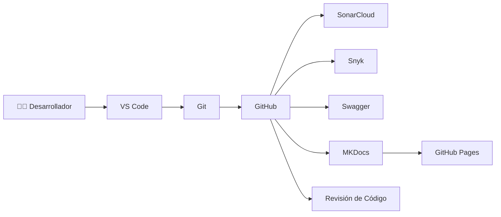
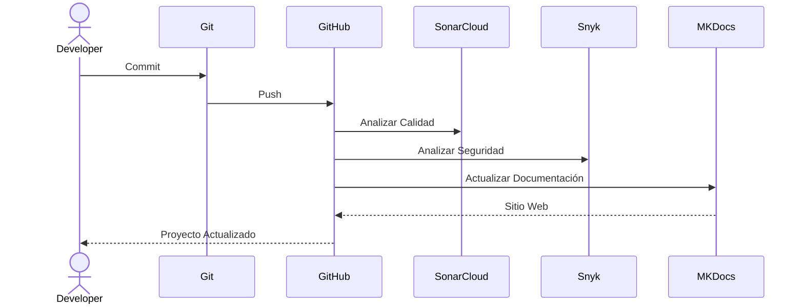
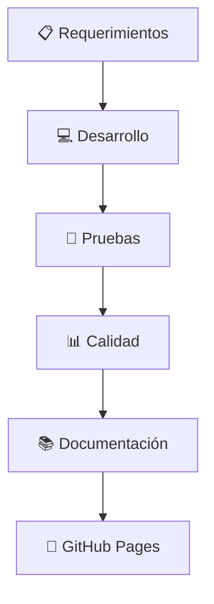

# 🚀 Arquitectura DevOps

## 📌 Introducción

El proceso de desarrollo de **Tridente Store** incorpora prácticas DevOps para mejorar la colaboración entre desarrollo, pruebas y despliegue.

La integración de herramientas como GitHub, SonarCloud, Snyk y MKDocs permite automatizar tareas, mejorar la calidad del software y mantener una documentación siempre actualizada.

---

# 🎯 Objetivos

- Controlar versiones del proyecto.
- Automatizar la documentación.
- Analizar la calidad del código.
- Detectar vulnerabilidades.
- Facilitar el despliegue continuo.
- Mantener trazabilidad de cambios.

---

# 🏗 Pipeline DevOps

---

# 🔄 Flujo DevOps

---

# 🛠 Herramientas utilizadas

| Herramienta | Función |
|-------------|----------|
| Git | Control de versiones |
| GitHub | Repositorio remoto |
| SonarCloud | Calidad del código |
| Snyk | Seguridad |
| Swagger | Documentación API |
| MKDocs | Documentación Web |
| GitHub Pages | Publicación |

---

# 📊 Flujo del Proyecto

---

# 📦 Beneficios

✅ Historial completo del proyecto.

✅ Versionamiento mediante Git.

✅ Mejor calidad del software.

✅ Menor riesgo de vulnerabilidades.

✅ Documentación siempre actualizada.

✅ Publicación automática.

---

# 🔄 Integración Continua

| Actividad | Herramienta |
|------------|-------------|
| Versionamiento | Git |
| Repositorio | GitHub |
| Calidad | SonarCloud |
| Seguridad | Snyk |
| API | Swagger |
| Documentación | MKDocs |
| Publicación | GitHub Pages |

---

!!! success "Resultado"

    La implementación de prácticas DevOps permitió mejorar la colaboración, automatizar la documentación y garantizar la calidad y seguridad del sistema Tridente Store.