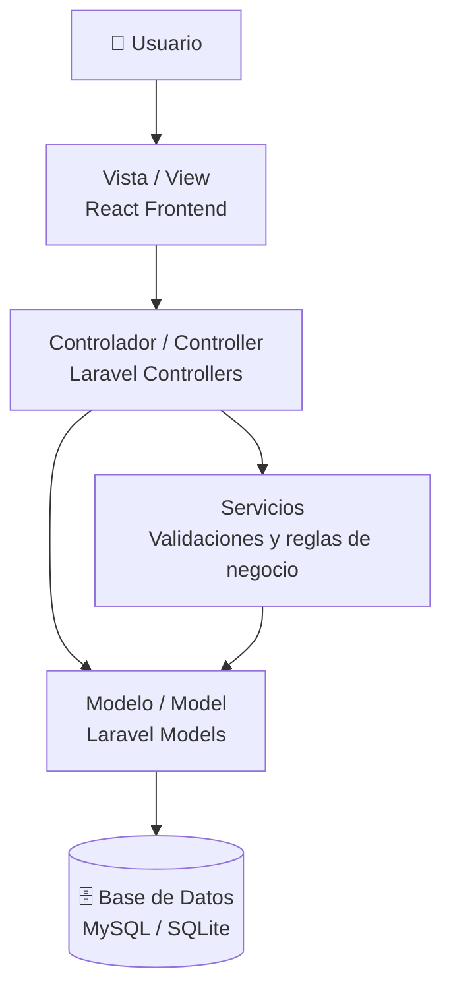
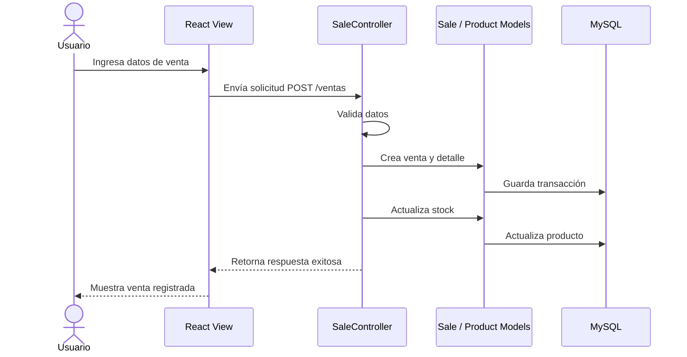

# 🧩 Arquitectura MVC

## 📌 Visión general

El sistema **Tridente Store** utiliza una organización basada en el patrón **MVC (Modelo - Vista - Controlador)**, permitiendo separar la interfaz de usuario, la lógica de negocio y el acceso a datos.

Esta estructura facilita el mantenimiento, la escalabilidad y la organización del código.

---

## 🏗 Diagrama MVC aplicado a Tridente Store

---

## 📦 Responsabilidades por capa

| Capa MVC | Tecnología | Responsabilidad |
|---|---|---|
| Vista | React | Presentar interfaces, formularios, tablas y reportes. |
| Controlador | Laravel Controllers | Procesar solicitudes, validar datos y coordinar la lógica. |
| Modelo | Laravel Models | Representar entidades como productos, usuarios, ventas y compras. |
| Base de Datos | MySQL / SQLite | Almacenar información persistente del sistema. |

---

## 🔄 Flujo MVC en una venta

---

## 🧠 Aplicación en módulos

| Módulo | Vista | Controlador | Modelo |
|---|---|---|---|
| Usuarios | Pantalla de usuarios | UserController | User |
| Productos | Pantalla de productos | ProductController | Product |
| Categorías | Pantalla de categorías | CategoryController | Category |
| Clientes | Pantalla de clientes | ClientController | Client |
| Proveedores | Pantalla de proveedores | SupplierController | Supplier |
| Ventas | Pantalla de ventas | SaleController | Sale |
| Compras | Pantalla de compras | PurchaseController | Purchase |
| Reportes | Dashboard / reportes | ReportController | Sale / Purchase / Product |

---

## ✅ Beneficios del patrón MVC

- Mejora la organización del código.
- Facilita el mantenimiento del sistema.
- Permite separar responsabilidades.
- Reduce el acoplamiento entre interfaz y lógica.
- Facilita pruebas y validaciones.
- Permite escalar módulos de forma independiente.

---

!!! success "Conclusión"

    La arquitectura MVC permite que **Tridente Store** mantenga una estructura clara y profesional, separando la presentación en React, la lógica de negocio en Laravel y la persistencia en MySQL/SQLite.