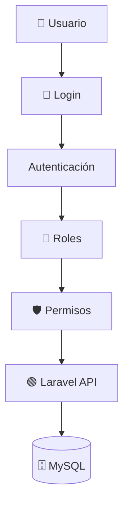
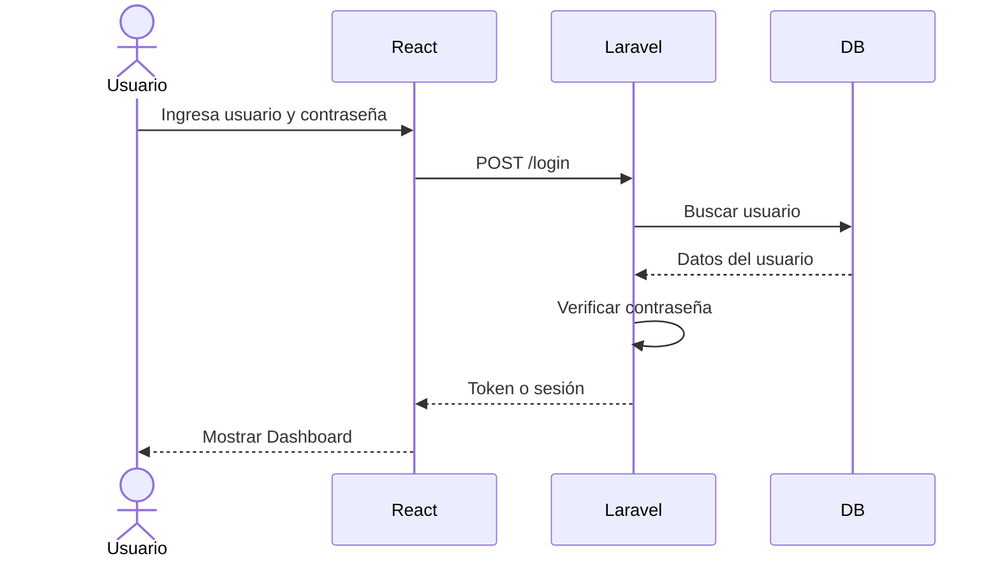
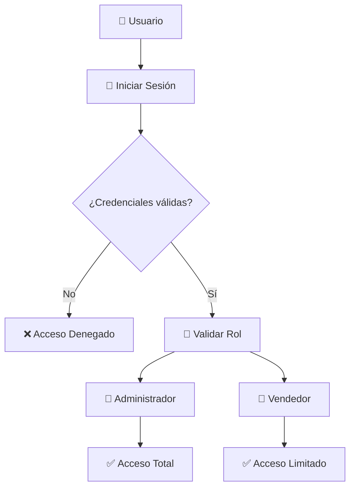
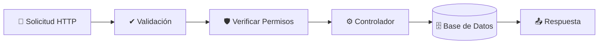

# 🔐 Arquitectura de Seguridad

## 📌 Introducción

La seguridad es uno de los pilares fundamentales de **Tridente Store**. Para proteger la información del sistema se implementan mecanismos de autenticación, autorización, validación de datos y control de acceso.

El objetivo es garantizar que únicamente los usuarios autorizados puedan acceder a las funcionalidades correspondientes según su rol.

---

## 🎯 Objetivos de Seguridad

- Proteger la información del sistema.
- Controlar el acceso mediante autenticación.
- Restringir funcionalidades según roles.
- Evitar accesos no autorizados.
- Validar los datos ingresados por los usuarios.
- Proteger la integridad de la base de datos.

---

## 🏗 Arquitectura de Seguridad



---

## 🔄 Flujo de Autenticación



---

## 🔐 Control de Acceso



---

## 👥 Roles del Sistema

| Rol | Funciones |
|------|-----------|
| Administrador | Gestiona usuarios, roles, productos, ventas, compras y reportes. |
| Vendedor | Registra ventas, clientes y consultas. |
| Supervisor | Consulta reportes y supervisa operaciones. |

---

## 🛡 Controles de Seguridad

| Control | Descripción |
|----------|-------------|
| Login | Acceso mediante credenciales. |
| Hash de contraseñas | Contraseñas almacenadas de forma segura. |
| Middleware | Protección de rutas privadas. |
| Roles | Restricción según tipo de usuario. |
| Validaciones | Evitan información inválida. |
| Variables de entorno | Protección de credenciales sensibles. |
| Gitignore | Evita subir archivos sensibles al repositorio. |
| Snyk | Revisión de vulnerabilidades en dependencias. |
| SonarCloud | Análisis de seguridad y mantenibilidad del código. |

---

## 🔍 Validación de Solicitudes



---

## 🔐 Protección de Credenciales

Durante la revisión de seguridad se identificó la importancia de no exponer credenciales dentro del código fuente. Para ello se emplean variables de entorno mediante el archivo `.env`.

```env
DB_CONNECTION=mysql
DB_HOST=${DB_HOST}
DB_DATABASE=${DB_DATABASE}
DB_USERNAME=${DB_USERNAME}
DB_PASSWORD=${DB_PASSWORD}
```

---

## 📊 Herramientas de Seguridad

| Herramienta | Uso |
|-------------|-----|
| Laravel Authentication | Autenticación de usuarios |
| Middleware | Protección de rutas |
| Policies | Control de permisos |
| Snyk | Detección de vulnerabilidades |
| SonarCloud | Seguridad del código |
| GitHub | Control de versiones |
| `.env` | Manejo seguro de credenciales |

---

## 🚀 Beneficios

- Protección de usuarios.
- Protección de datos.
- Restricción de acceso.
- Menor riesgo de ataques.
- Integridad de la información.
- Seguridad en la API.
- Mejor control de credenciales.
- Reducción de vulnerabilidades.

---

!!! success "Conclusión"

    La arquitectura de seguridad implementada en **Tridente Store** protege el acceso al sistema mediante autenticación, autorización y validación de datos, asegurando la confidencialidad, integridad y disponibilidad de la información.