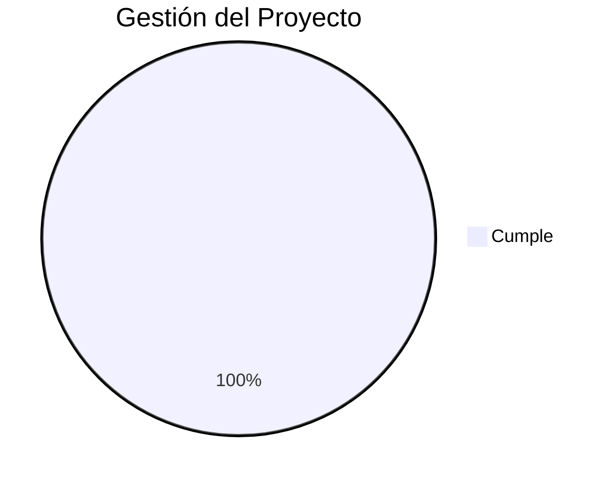

# 📂 A01 - Auditoría de la Gestión del Proyecto

## 📖 Descripción del Alcance

Este alcance evalúa la correcta planificación, organización, seguimiento y documentación del proyecto **Tridente Store**, verificando que las actividades desarrolladas durante el ciclo de vida del software se encuentren alineadas con las buenas prácticas de Ingeniería de Software.

La revisión considera la existencia de objetivos claros, planificación de actividades, entregables, cronograma, tecnologías utilizadas y documentación generada durante el desarrollo.

---

# 🎯 Objetivo del Alcance

Verificar que la gestión del proyecto haya sido planificada, ejecutada y documentada correctamente, garantizando la trazabilidad de cada entregable desarrollado.

---

# 📋 Elementos Auditados

- Planificación
- Objetivos
- Alcance
- Tecnologías
- Cronograma
- Entregables
- Organización documental
- Gestión del repositorio
- Seguimiento del proyecto
- Evidencias

---

# 🔄 Proceso de Gestión

---

# ✅ Checklist de Auditoría

| Código | Criterio | Estado | Evidencia | Observación |
|---------|----------|:------:|-----------|-------------|
| GP-01 | El proyecto posee objetivos definidos | ✅ | Objetivos | Conforme |
| GP-02 | El alcance está documentado | ✅ | Alcance | Conforme |
| GP-03 | Se identificó el problema | ✅ | Descripción | Conforme |
| GP-04 | Existe una solución propuesta | ✅ | Proyecto | Conforme |
| GP-05 | Se definieron tecnologías | ✅ | Tecnologías | Conforme |
| GP-06 | Existe estructura documental | ✅ | MKDocs | Conforme |
| GP-07 | Se documentaron las fases | ✅ | Fases | Conforme |
| GP-08 | Existen entregables | ✅ | Fases | Conforme |
| GP-09 | Se mantiene trazabilidad | ✅ | GitHub | Conforme |
| GP-10 | Existe documentación técnica | ✅ | Manual Técnico | Conforme |
| GP-11 | Existe manual de usuario | ✅ | Manual Usuario | Conforme |
| GP-12 | Existen evidencias | ✅ | Capturas | Conforme |
| GP-13 | Arquitectura documentada | ✅ | Arquitectura | Conforme |
| GP-14 | API documentada | ✅ | Swagger | Conforme |
| GP-15 | Calidad documentada | ✅ | SonarCloud | Conforme |

---

# 📊 Nivel de Cumplimiento

---

# 📈 Indicadores

| Indicador | Resultado |
|------------|-----------|
| Planificación | 100% |
| Organización | 100% |
| Documentación | 100% |
| Seguimiento | 100% |
| Entregables | 100% |

---

# 📑 Evidencias Revisadas

| Evidencia | Estado |
|------------|:------:|
| Proyecto | ✅ |
| Objetivos | ✅ |
| Alcance | ✅ |
| Tecnologías | ✅ |
| Fases | ✅ |
| Arquitectura | ✅ |
| GitHub | ✅ |
| Manual Técnico | ✅ |
| Manual Usuario | ✅ |

---

# 🔍 Hallazgos

## Fortalezas

- Objetivos claramente definidos.
- Organización adecuada de la documentación.
- Buena estructura del proyecto.
- Uso de GitHub para el control de versiones.
- Documentación técnica organizada mediante MKDocs.

---

## Oportunidades de Mejora

- Automatizar el seguimiento del proyecto mediante herramientas CI/CD.
- Incorporar métricas automáticas del avance del proyecto.
- Integrar seguimiento de incidencias mediante GitHub Issues.

---

# ⚠️ Riesgos Identificados

| Riesgo | Impacto | Probabilidad |
|---------|----------|--------------|
| Documentación desactualizada | Medio | Bajo |
| Cambios sin registrar | Medio | Bajo |
| Dependencias obsoletas | Alto | Bajo |

---

# 💡 Recomendaciones

- Mantener actualizada la documentación.
- Versionar cada cambio importante.
- Revisar periódicamente la planificación del proyecto.
- Actualizar dependencias del sistema.

---

# 🏁 Conclusión del Alcance

La auditoría realizada sobre la gestión del proyecto evidencia que **Tridente Store** cuenta con una planificación adecuada, documentación organizada y entregables correctamente estructurados. Se verifica un **cumplimiento del 100%** respecto a los criterios definidos para este alcance, demostrando una gestión consistente durante el desarrollo del proyecto.

!!! success "Resultado del Alcance"

    La Gestión del Proyecto cumple satisfactoriamente con los criterios establecidos para la auditoría.