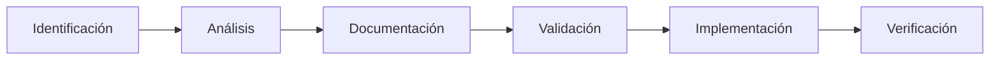
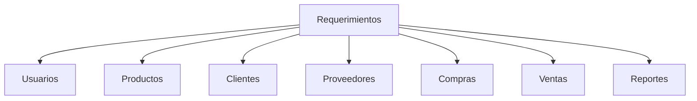

# 📑 A02 - Auditoría de Requerimientos

## 📖 Descripción del Alcance

Este alcance tiene como finalidad evaluar la correcta identificación, documentación, implementación y trazabilidad de los requerimientos funcionales y no funcionales del proyecto **Tridente Store**.

La revisión considera que los requerimientos constituyen la base para el desarrollo del sistema, permitiendo verificar que las funcionalidades implementadas responden a las necesidades del negocio y que los atributos de calidad fueron considerados durante el desarrollo.

La auditoría analiza la consistencia entre los requerimientos definidos, la arquitectura propuesta y la implementación final del sistema.

---

# 🎯 Objetivo del Alcance

Verificar que los requerimientos funcionales y no funcionales del sistema hayan sido correctamente identificados, documentados, implementados y validados durante el desarrollo del proyecto.

---

# 📌 Componentes Auditados

- Requerimientos funcionales
- Requerimientos no funcionales
- Casos de uso
- Trazabilidad
- Cobertura funcional
- Restricciones técnicas
- Priorización
- Validación
- Consistencia documental

---

# 🔄 Proceso de Gestión de Requerimientos

---

# 📋 Checklist de Auditoría

| Código | Criterio Evaluado | Estado | Evidencia | Observación |
|---------|-------------------|:------:|-----------|-------------|
| RF-01 | Se identificaron requerimientos funcionales | ✅ | Documento del Proyecto | Conforme |
| RF-02 | Se documentaron requerimientos no funcionales | ✅ | Proyecto | Conforme |
| RF-03 | Los requerimientos están organizados | ✅ | Documentación | Conforme |
| RF-04 | Existe trazabilidad | ✅ | Arquitectura | Conforme |
| RF-05 | Los requerimientos fueron implementados | ✅ | Sistema | Conforme |
| RF-06 | Existe correspondencia con la arquitectura | ✅ | Arquitectura | Conforme |
| RF-07 | Los requerimientos son consistentes | ✅ | Proyecto | Conforme |
| RF-08 | Se definieron restricciones | ✅ | Tecnologías | Conforme |
| RF-09 | Existe cobertura funcional | ✅ | Sistema | Conforme |
| RF-10 | Los módulos responden al problema planteado | ✅ | Sistema | Conforme |
| RF-11 | Se definieron actores | ✅ | Casos de uso | Conforme |
| RF-12 | Existe validación de entradas | ✅ | Laravel | Conforme |
| RF-13 | Se contempló seguridad | ✅ | Arquitectura | Conforme |
| RF-14 | Se documentó la API | ✅ | Swagger | Conforme |
| RF-15 | Se actualizaron los requerimientos durante el desarrollo | ✅ | GitHub | Conforme |
| RF-16 | Existe documentación técnica | ✅ | MKDocs | Conforme |
| RF-17 | Existe documentación funcional | ✅ | Manual Usuario | Conforme |
| RF-18 | Se evidencia implementación real | ✅ | Capturas | Conforme |
| RF-19 | Se evaluó calidad | ✅ | SonarCloud | Conforme |
| RF-20 | Existe evidencia del cumplimiento | ✅ | Documentación | Conforme |

---

# 📊 Clasificación de Requerimientos

| Tipo | Cantidad | Estado |
|--------|---------:|:------:|
| Funcionales | 9 | ✅ |
| No Funcionales | 8 | ✅ |
| Restricciones Técnicas | 6 | ✅ |
| Seguridad | 5 | ✅ |
| Calidad | 5 | ✅ |

---

# 📈 Matriz de Cobertura

---

# 📑 Evidencias Revisadas

| Evidencia | Estado |
|------------|:------:|
| Documento de Requerimientos | ✅ |
| Arquitectura | ✅ |
| Casos de Uso | ✅ |
| Sistema Implementado | ✅ |
| Manual Técnico | ✅ |
| Manual Usuario | ✅ |
| Swagger | ✅ |
| MKDocs | ✅ |

---

# 📊 Indicadores

| Indicador | Cumplimiento |
|------------|-------------:|
| Identificación | 100% |
| Documentación | 100% |
| Implementación | 100% |
| Validación | 100% |
| Cobertura | 100% |

---

# 🔍 Hallazgos

## Fortalezas

- Los requerimientos fueron correctamente documentados.
- Existe correspondencia entre requerimientos y módulos implementados.
- Se evidencia trazabilidad.
- Los requerimientos funcionales fueron implementados completamente.
- La documentación mantiene consistencia con el desarrollo.

---

## Oportunidades de Mejora

- Incorporar una matriz formal de trazabilidad.
- Automatizar la gestión de cambios de requerimientos.
- Asociar requerimientos directamente con historias de usuario.

---

# ⚠️ Riesgos Identificados

| Riesgo | Impacto | Probabilidad |
|---------|----------|--------------|
| Cambios de requerimientos | Alto | Bajo |
| Requerimientos incompletos | Medio | Bajo |
| Cambios sin documentar | Medio | Bajo |

---

# 💡 Recomendaciones

- Mantener una matriz de trazabilidad actualizada.
- Registrar cualquier modificación de requerimientos.
- Validar los requerimientos con los interesados antes de cada iteración.
- Documentar nuevas funcionalidades antes de implementarlas.

---

# 🏁 Conclusión del Alcance

La auditoría realizada evidencia que los requerimientos funcionales y no funcionales del proyecto **Tridente Store** fueron correctamente identificados, documentados e implementados. Se verifica una adecuada correspondencia entre los requerimientos definidos, la arquitectura propuesta y la solución desarrollada, alcanzando un **nivel de cumplimiento del 100%** para este alcance.

!!! success "Resultado del Alcance"

    El alcance A02 cumple satisfactoriamente con los criterios establecidos para la auditoría de requerimientos.