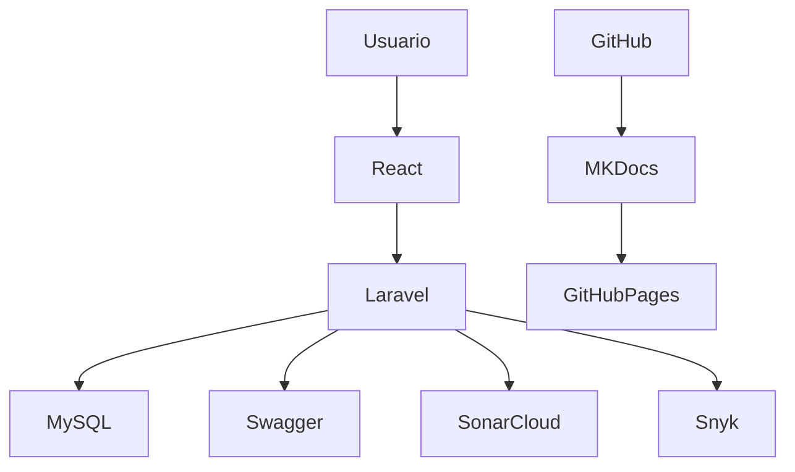
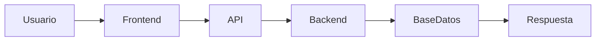
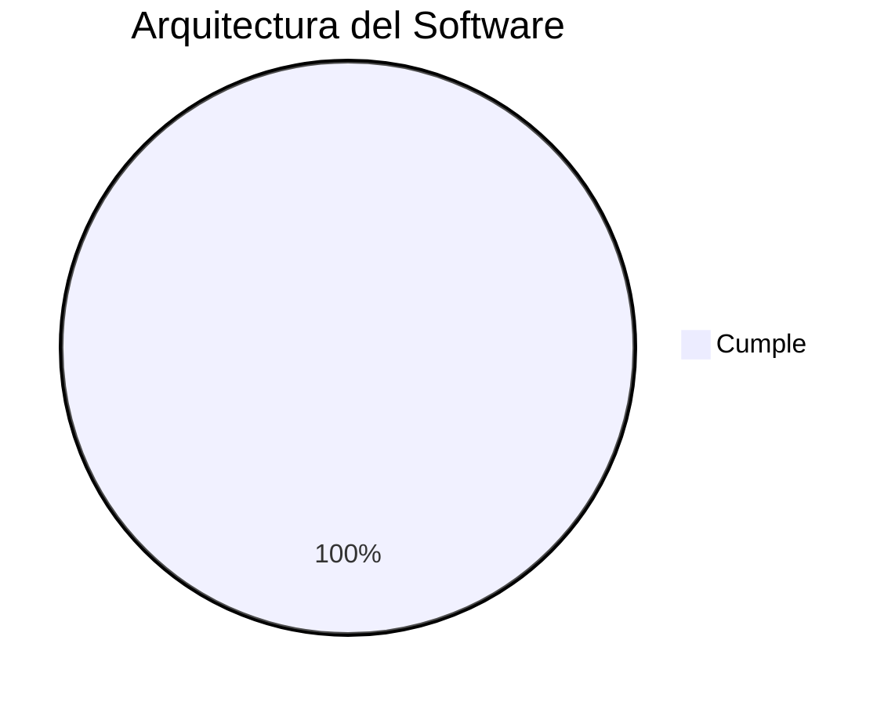

# 🏛 A03 - Auditoría de la Arquitectura del Software

## 📖 Descripción del Alcance

Este alcance evalúa la arquitectura implementada en **Tridente Store**, verificando que la estructura del sistema responda a los principios de modularidad, escalabilidad, mantenibilidad, seguridad y separación de responsabilidades.

La auditoría considera la documentación arquitectónica elaborada, la implementación real del sistema y la correspondencia entre el diseño propuesto y el producto final desarrollado.

Asimismo, se revisan los diferentes modelos arquitectónicos utilizados durante el proyecto, incluyendo Cliente–Servidor, MVC, Modelo C4, arquitectura de base de datos, arquitectura de seguridad y prácticas DevOps.

---

# 🎯 Objetivo del Alcance

Verificar que la arquitectura del sistema haya sido correctamente diseñada, documentada e implementada, asegurando que permita el mantenimiento, evolución y escalabilidad del proyecto.

---

# 📌 Componentes Evaluados

- Arquitectura General
- Modelo C4
- Arquitectura Cliente - Servidor
- Arquitectura MVC
- Base de Datos
- Arquitectura de Seguridad
- DevOps
- Calidad Arquitectónica
- Comparación Arquitectónica

---

# 🏗 Modelo Arquitectónico Evaluado

---

# 📋 Checklist de Auditoría Arquitectónica

| Código | Criterio | Estado | Evidencia | Observación |
|---------|----------|:------:|-----------|-------------|
| ARQ-01 | Existe arquitectura general | ✅ | Arquitectura General | Conforme |
| ARQ-02 | Arquitectura documentada | ✅ | MKDocs | Conforme |
| ARQ-03 | Arquitectura Cliente–Servidor implementada | ✅ | Sistema | Conforme |
| ARQ-04 | Arquitectura MVC implementada | ✅ | Laravel | Conforme |
| ARQ-05 | Modelo C4 documentado | ✅ | Arquitectura | Conforme |
| ARQ-06 | Base de datos modelada | ✅ | DER | Conforme |
| ARQ-07 | Arquitectura de seguridad definida | ✅ | Seguridad | Conforme |
| ARQ-08 | Arquitectura DevOps documentada | ✅ | DevOps | Conforme |
| ARQ-09 | Separación de responsabilidades | ✅ | Código Fuente | Conforme |
| ARQ-10 | API desacoplada | ✅ | Swagger | Conforme |
| ARQ-11 | Documentación técnica completa | ✅ | MKDocs | Conforme |
| ARQ-12 | Modularidad del sistema | ✅ | Laravel | Conforme |
| ARQ-13 | Escalabilidad | ✅ | Arquitectura | Conforme |
| ARQ-14 | Reutilización de componentes | ✅ | React | Conforme |
| ARQ-15 | Integración Frontend-Backend | ✅ | Sistema | Conforme |
| ARQ-16 | Integración Base de Datos | ✅ | MySQL | Conforme |
| ARQ-17 | Integración GitHub | ✅ | GitHub | Conforme |
| ARQ-18 | Integración SonarCloud | ✅ | SonarCloud | Conforme |
| ARQ-19 | Integración Snyk | ✅ | Snyk | Conforme |
| ARQ-20 | Comparación arquitectura diseñada vs implementada | ✅ | Comparación | Conforme |

---

# 📊 Componentes Arquitectónicos

| Componente | Estado |
|-------------|:------:|
| Arquitectura General | ✅ |
| Cliente - Servidor | ✅ |
| MVC | ✅ |
| Modelo C4 | ✅ |
| Base de Datos | ✅ |
| Seguridad | ✅ |
| DevOps | ✅ |
| Calidad | ✅ |

---

# 📈 Flujo Arquitectónico

---

# 📊 Nivel de Cumplimiento

---

# 📑 Evidencias Revisadas

| Evidencia | Estado |
|------------|:------:|
| Arquitectura General | ✅ |
| Modelo C4 | ✅ |
| MVC | ✅ |
| Cliente Servidor | ✅ |
| Base de Datos | ✅ |
| Seguridad | ✅ |
| DevOps | ✅ |
| Calidad | ✅ |
| Swagger | ✅ |
| GitHub | ✅ |

---

# 🔍 Hallazgos

## Fortalezas

- Arquitectura claramente documentada.
- Separación adecuada entre capas.
- Arquitectura modular.
- Uso correcto del patrón MVC.
- API desacoplada.
- Integración con herramientas de calidad.
- Documentación arquitectónica completa.

---

## Oportunidades de Mejora

- Incorporar microservicios en futuras versiones.
- Automatizar el despliegue mediante CI/CD.
- Implementar monitoreo continuo.
- Integrar contenedores Docker.

---

# ⚠️ Riesgos Identificados

| Riesgo | Impacto | Probabilidad |
|---------|----------|--------------|
| Crecimiento del sistema | Medio | Bajo |
| Cambios arquitectónicos futuros | Alto | Bajo |
| Dependencias externas | Medio | Bajo |

---

# 💡 Recomendaciones

- Mantener la arquitectura modular.
- Actualizar periódicamente la documentación.
- Incorporar pruebas arquitectónicas.
- Automatizar despliegues.
- Mantener sincronizada la arquitectura con el código.

---

# 🏁 Conclusión del Alcance

La arquitectura implementada en **Tridente Store** demuestra una adecuada organización estructural basada en los principios de separación de responsabilidades, modularidad y mantenibilidad. La revisión evidencia que la implementación mantiene coherencia con el diseño definido y permite la evolución futura del sistema sin afectar sus componentes principales.

El alcance obtiene un **100% de cumplimiento**, verificándose que la arquitectura soporta correctamente los procesos funcionales del sistema y cumple con las buenas prácticas de Ingeniería de Software.

!!! success "Resultado del Alcance"

    La arquitectura del sistema cumple satisfactoriamente con todos los criterios técnicos establecidos para la auditoría.