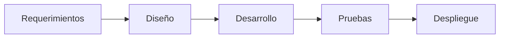
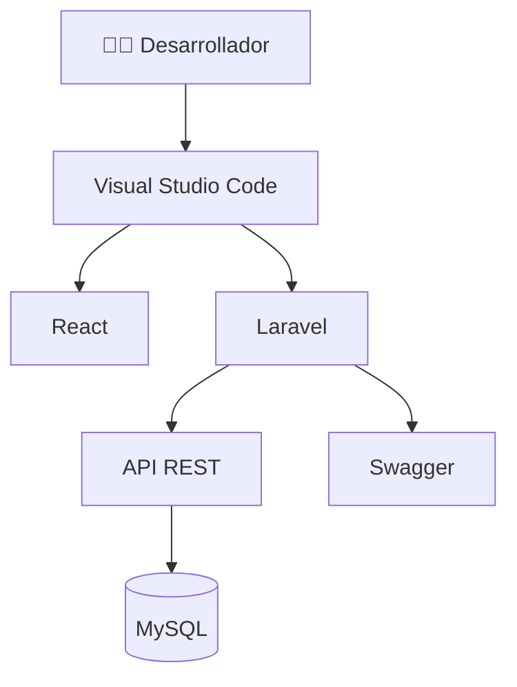

# 💻 A04 - Auditoría del Desarrollo del Software

## 📖 Descripción del Alcance

El presente alcance evalúa el proceso de desarrollo del sistema **Tridente Store**, verificando que la implementación del software haya seguido buenas prácticas de programación, una estructura organizada del código y una correcta integración entre los diferentes componentes del sistema.

Asimismo, se revisa la utilización de tecnologías modernas, la organización del proyecto, el control de versiones y la mantenibilidad del código fuente.

---

# 🎯 Objetivo del Alcance

Verificar que el desarrollo del sistema haya sido realizado utilizando buenas prácticas de Ingeniería de Software, asegurando un código organizado, mantenible y escalable.

---

# 📌 Componentes Evaluados

- Organización del proyecto
- Backend Laravel
- Frontend React
- API REST
- Base de Datos
- Integración Frontend - Backend
- Control de versiones
- Estructura del código
- Reutilización de componentes
- Buenas prácticas

---

# 🏗 Flujo General del Desarrollo

---

# 📋 Checklist de Auditoría

| Código | Criterio | Estado | Evidencia | Observación |
|---------|----------|:------:|-----------|-------------|
| DEV-01 | Proyecto estructurado correctamente | ✅ | Código Fuente | Conforme |
| DEV-02 | Backend desarrollado en Laravel | ✅ | Laravel | Conforme |
| DEV-03 | Frontend desarrollado en React | ✅ | React | Conforme |
| DEV-04 | API REST implementada | ✅ | Swagger | Conforme |
| DEV-05 | Integración Frontend - Backend | ✅ | Sistema | Conforme |
| DEV-06 | Organización modular | ✅ | Código | Conforme |
| DEV-07 | Uso de Controladores | ✅ | Laravel | Conforme |
| DEV-08 | Uso de Modelos | ✅ | Laravel | Conforme |
| DEV-09 | Uso de Migraciones | ✅ | Base de Datos | Conforme |
| DEV-10 | Uso de Seeders | ✅ | Laravel | Conforme |
| DEV-11 | Validaciones implementadas | ✅ | Código | Conforme |
| DEV-12 | Manejo de errores | ✅ | Laravel | Conforme |
| DEV-13 | Separación de responsabilidades | ✅ | Arquitectura | Conforme |
| DEV-14 | Reutilización de componentes | ✅ | React | Conforme |
| DEV-15 | Código mantenible | ✅ | SonarCloud | Conforme |
| DEV-16 | Código documentado | ✅ | MKDocs | Conforme |
| DEV-17 | Versionamiento mediante Git | ✅ | GitHub | Conforme |
| DEV-18 | Historial de cambios | ✅ | GitHub | Conforme |
| DEV-19 | Integración de herramientas | ✅ | SonarCloud / Snyk | Conforme |
| DEV-20 | Desarrollo finalizado correctamente | ✅ | Sistema | Conforme |

---

# 📊 Arquitectura del Desarrollo

---

# 📈 Indicadores de Desarrollo

| Indicador | Resultado |
|------------|-----------:|
| Organización del Código | 100% |
| Modularidad | 100% |
| Integración | 100% |
| Mantenibilidad | 100% |
| Escalabilidad | 100% |

---

# 📑 Evidencias Revisadas

| Evidencia | Estado |
|------------|:------:|
| Código Fuente | ✅ |
| Laravel | ✅ |
| React | ✅ |
| Swagger | ✅ |
| GitHub | ✅ |
| SonarCloud | ✅ |
| Snyk | ✅ |
| Documentación | ✅ |

---

# 🔍 Hallazgos

## Fortalezas

- Código organizado por módulos.
- Correcta separación entre frontend y backend.
- Uso de arquitectura MVC.
- API REST correctamente implementada.
- Uso de Git para el control de versiones.
- Integración con herramientas de calidad.

---

## Oportunidades de Mejora

- Incorporar pruebas unitarias automatizadas.
- Implementar integración continua (CI).
- Añadir pruebas de integración.
- Incrementar la cobertura de pruebas.

---

# ⚠️ Riesgos Identificados

| Riesgo | Impacto | Probabilidad |
|---------|----------|--------------|
| Errores en futuras modificaciones | Medio | Bajo |
| Dependencias desactualizadas | Alto | Bajo |
| Ausencia de pruebas automáticas | Medio | Medio |

---

# 💡 Recomendaciones

- Implementar pruebas automatizadas.
- Mantener actualizadas las dependencias.
- Continuar aplicando buenas prácticas de programación.
- Realizar revisiones de código periódicas.
- Mantener la documentación sincronizada con el desarrollo.

---

# 🏁 Conclusión del Alcance

La auditoría evidencia que el desarrollo de **Tridente Store** fue realizado siguiendo una estructura organizada y modular, utilizando tecnologías modernas y buenas prácticas de Ingeniería de Software. El código fuente presenta un alto nivel de mantenibilidad, integración y escalabilidad, alcanzando un **100% de cumplimiento** en los criterios evaluados.

!!! success "Resultado del Alcance"

    El proceso de desarrollo del software cumple satisfactoriamente con los criterios establecidos para la auditoría técnica.