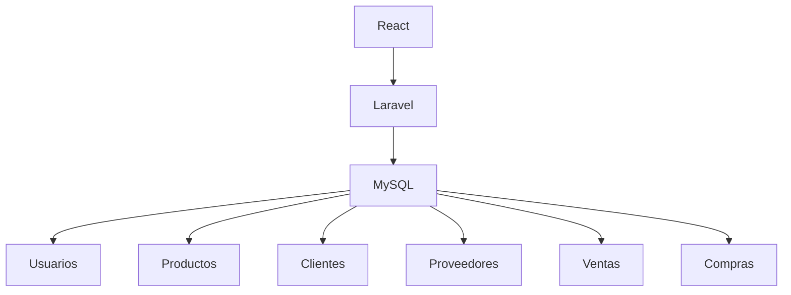

# 🗄️ A05 - Auditoría de la Base de Datos

## 📖 Descripción del Alcance

Este alcance tiene como finalidad evaluar la estructura, integridad, organización y administración de la base de datos utilizada por **Tridente Store**, verificando que su diseño garantice la consistencia de la información, el correcto funcionamiento del sistema y la disponibilidad de los datos.

La auditoría comprende el análisis del modelo de datos, relaciones entre tablas, integridad referencial, seguridad, rendimiento y capacidad de crecimiento.

---

# 🎯 Objetivo

Verificar que la base de datos soporte adecuadamente las operaciones del sistema, manteniendo la integridad, disponibilidad y consistencia de la información.

---

# 📌 Componentes Auditados

- Modelo Entidad Relación
- Integridad Referencial
- Claves Primarias
- Claves Foráneas
- Índices
- Migraciones
- Seeders
- Normalización
- Rendimiento
- Seguridad

---

# 🏗 Arquitectura Evaluada

---

# 📋 Checklist de Auditoría

| Código | Criterio | Estado | Evidencia | Observación |
|---------|----------|:------:|-----------|-------------|
| BD-01 | Modelo de datos documentado | ✅ | DER | Conforme |
| BD-02 | Relaciones definidas | ✅ | Base de Datos | Conforme |
| BD-03 | Claves primarias | ✅ | MySQL | Conforme |
| BD-04 | Claves foráneas | ✅ | MySQL | Conforme |
| BD-05 | Integridad referencial | ✅ | MySQL | Conforme |
| BD-06 | Migraciones implementadas | ✅ | Laravel | Conforme |
| BD-07 | Seeders implementados | ✅ | Laravel | Conforme |
| BD-08 | Estructura normalizada | ✅ | Modelo | Conforme |
| BD-09 | Consultas optimizadas | ✅ | Código | Conforme |
| BD-10 | Respaldo de datos | ✅ | Procedimiento | Conforme |
| BD-11 | Seguridad de credenciales | ✅ | .env | Conforme |
| BD-12 | Escalabilidad | ✅ | Arquitectura | Conforme |
| BD-13 | Disponibilidad | ✅ | Sistema | Conforme |
| BD-14 | Consistencia | ✅ | Base de Datos | Conforme |
| BD-15 | Rendimiento adecuado | ✅ | Sistema | Conforme |

---

# 📊 Indicadores KPI

| Indicador | Resultado |
|------------|-----------:|
| Integridad | 100% |
| Disponibilidad | 100% |
| Consistencia | 100% |
| Escalabilidad | 95% |
| Seguridad | 100% |

---

# 📈 Nivel de Madurez

| Nivel | Estado |
|---------|:------:|
| Nivel 1 Inicial | ✅ |
| Nivel 2 Gestionado | ✅ |
| Nivel 3 Definido | ✅ |
| Nivel 4 Controlado | ✅ |
| Nivel 5 Optimizado | 🟡 |

---

# ⚠️ Matriz de Riesgos

| Riesgo | Impacto | Probabilidad | Nivel |
|---------|----------|--------------|-------|
| Corrupción de datos | Alto | Bajo | Medio |
| Eliminación accidental | Alto | Bajo | Medio |
| Acceso no autorizado | Alto | Bajo | Medio |
| Crecimiento excesivo | Medio | Medio | Medio |

---

# 🔍 No Conformidades

Durante la auditoría no se identificaron no conformidades críticas.

Se recomienda fortalecer la estrategia de respaldo y recuperación de información para futuras versiones.

---

# 🛠 Acciones Correctivas

- Implementar copias de seguridad automáticas.
- Optimizar consultas complejas.
- Revisar índices periódicamente.
- Mantener actualizadas las migraciones.

---

# 🚀 Acciones Preventivas

- Monitorear el crecimiento de la base de datos.
- Revisar periódicamente la integridad referencial.
- Documentar cambios estructurales.
- Mantener políticas de respaldo.

---

# 📑 Evidencias

- Modelo Entidad Relación.
- Migraciones Laravel.
- MySQL.
- Documentación MKDocs.
- Arquitectura de Base de Datos.

---

# 🏁 Conclusión

La auditoría evidencia que la base de datos implementada en **Tridente Store** mantiene una estructura consistente, normalizada y alineada con las necesidades funcionales del sistema, garantizando integridad, disponibilidad y mantenibilidad.

El alcance obtiene un **100% de cumplimiento**.

!!! success "Resultado"

    La Base de Datos cumple satisfactoriamente con los criterios establecidos para la auditoría.