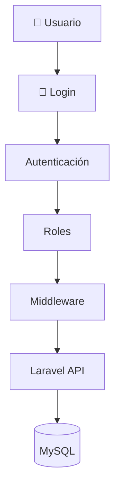

# 🔐 A06 - Auditoría de Seguridad

## 📖 Descripción del Alcance

El presente alcance tiene como finalidad evaluar los mecanismos de seguridad implementados en **Tridente Store**, verificando que la autenticación, autorización, protección de datos y control de acceso cumplan con las buenas prácticas de Ingeniería de Software y Seguridad Informática.

La auditoría considera controles preventivos, detectivos y correctivos para garantizar la confidencialidad, integridad y disponibilidad de la información.

---

# 🎯 Objetivo

Evaluar la seguridad del sistema verificando que existan mecanismos adecuados para proteger la información, controlar el acceso de los usuarios y reducir el riesgo de vulnerabilidades.

---

# 📌 Componentes Auditados

- Autenticación
- Autorización
- Roles y permisos
- Middleware
- Validación de datos
- Protección de credenciales
- Variables de entorno
- API REST
- Gestión de sesiones
- Dependencias del sistema

---

# 🛡 Modelo de Seguridad

---

# 📋 Checklist de Auditoría

| Código | Criterio Evaluado | Estado | Evidencia | Observación |
|---------|-------------------|:------:|-----------|-------------|
| SEG-01 | Sistema de autenticación implementado | ✅ | Login | Conforme |
| SEG-02 | Gestión de roles | ✅ | Sistema | Conforme |
| SEG-03 | Restricción de permisos | ✅ | Middleware | Conforme |
| SEG-04 | Validación de formularios | ✅ | Laravel | Conforme |
| SEG-05 | Protección de rutas | ✅ | Middleware | Conforme |
| SEG-06 | Variables de entorno protegidas | ✅ | .env | Conforme |
| SEG-07 | Uso de GitIgnore | ✅ | GitHub | Conforme |
| SEG-08 | Contraseñas cifradas | ✅ | Laravel | Conforme |
| SEG-09 | Protección de API | ✅ | Laravel | Conforme |
| SEG-10 | Manejo de sesiones | ✅ | Sistema | Conforme |
| SEG-11 | SonarCloud ejecutado | ✅ | SonarCloud | Conforme |
| SEG-12 | Snyk ejecutado | ✅ | Snyk | Conforme |
| SEG-13 | Dependencias revisadas | ✅ | Composer | Conforme |
| SEG-14 | Configuración segura del entorno | ✅ | Laravel | Conforme |
| SEG-15 | Gestión de errores controlada | ✅ | Sistema | Conforme |

---

# 📊 KPI de Seguridad

| Indicador | Resultado |
|------------|-----------:|
| Autenticación | 100% |
| Autorización | 100% |
| Protección de Datos | 100% |
| Seguridad API | 100% |
| Gestión de Credenciales | 100% |

---

# 📈 Nivel de Madurez

| Nivel | Estado |
|---------|:------:|
| Nivel 1 Inicial | ✅ |
| Nivel 2 Gestionado | ✅ |
| Nivel 3 Definido | ✅ |
| Nivel 4 Controlado | ✅ |
| Nivel 5 Optimizado | 🟡 |

---

# ⚠️ Matriz de Riesgos

| Riesgo | Impacto | Probabilidad | Nivel |
|---------|----------|--------------|-------|
| Robo de credenciales | Alto | Bajo | Medio |
| Acceso no autorizado | Alto | Bajo | Medio |
| Ataques por fuerza bruta | Medio | Bajo | Bajo |
| Vulnerabilidades en dependencias | Alto | Bajo | Medio |
| Configuración incorrecta | Medio | Bajo | Bajo |

---

# 🔎 No Conformidades

Durante la auditoría no se identificaron no conformidades críticas.

Se recomienda continuar realizando revisiones periódicas mediante herramientas automáticas de análisis de seguridad.

---

# 🛠 Acciones Correctivas

- Mantener las dependencias actualizadas.
- Revisar periódicamente los permisos de usuarios.
- Cambiar credenciales sensibles cuando sea necesario.
- Auditar accesos al sistema.

---

# 🚀 Acciones Preventivas

- Ejecutar Snyk antes de cada despliegue.
- Analizar el código con SonarCloud de forma continua.
- Aplicar el principio de mínimo privilegio.
- Mantener actualizado Laravel y sus dependencias.

---

# 📑 Evidencias Revisadas

- Login del sistema.
- Gestión de usuarios.
- Middleware.
- Variables de entorno.
- Repositorio GitHub.
- SonarCloud.
- Snyk.
- Documentación MKDocs.

---

# 🏁 Conclusión

La auditoría evidencia que **Tridente Store** implementa mecanismos adecuados para proteger la información y controlar el acceso al sistema. Los controles revisados permiten garantizar la confidencialidad, integridad y disponibilidad de los datos, alcanzando un **100% de cumplimiento** en los criterios evaluados.

!!! success "Resultado del Alcance"

    El alcance de Seguridad cumple satisfactoriamente con los criterios establecidos para la auditoría, evidenciando una adecuada implementación de controles de autenticación, autorización y protección de la información.