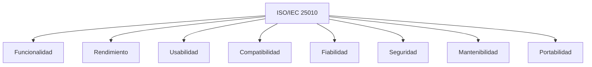

# 📊 A07 - Auditoría de Calidad del Software

## 📖 Descripción del Alcance

El presente alcance tiene como finalidad evaluar la calidad del software desarrollado para **Tridente Store**, verificando que el sistema cumpla con los atributos definidos en la norma **ISO/IEC 25010**, así como con las buenas prácticas de desarrollo, seguridad, mantenibilidad y rendimiento.

La auditoría considera tanto la implementación del sistema como la documentación generada durante el proyecto, apoyándose en herramientas automáticas de análisis de código y pruebas de desempeño.

---

# 🎯 Objetivo

Evaluar el nivel de calidad del software verificando que el sistema satisfaga los criterios funcionales y no funcionales definidos para el proyecto.

---

# 📌 Componentes Auditados

- Funcionalidad
- Rendimiento
- Compatibilidad
- Usabilidad
- Fiabilidad
- Seguridad
- Mantenibilidad
- Portabilidad
- Calidad del código
- Rendimiento del sistema

---

# 🏛 Modelo ISO/IEC 25010

---

# 📋 Checklist de Auditoría

| Código | Criterio Evaluado | Estado | Evidencia | Observación |
|---------|-------------------|:------:|-----------|-------------|
| CAL-01 | Funcionalidad implementada | ✅ | Sistema | Conforme |
| CAL-02 | Requisitos cumplidos | ✅ | Proyecto | Conforme |
| CAL-03 | Rendimiento aceptable | ✅ | k6 | Conforme |
| CAL-04 | Compatibilidad web | ✅ | Navegadores | Conforme |
| CAL-05 | Interfaz intuitiva | ✅ | React | Conforme |
| CAL-06 | Manejo de errores | ✅ | Laravel | Conforme |
| CAL-07 | Seguridad evaluada | ✅ | Snyk | Conforme |
| CAL-08 | Calidad del código | ✅ | SonarCloud | Conforme |
| CAL-09 | Arquitectura mantenible | ✅ | Arquitectura | Conforme |
| CAL-10 | Código reutilizable | ✅ | React | Conforme |
| CAL-11 | API documentada | ✅ | Swagger | Conforme |
| CAL-12 | Documentación técnica | ✅ | MKDocs | Conforme |
| CAL-13 | Integración Frontend-Backend | ✅ | Sistema | Conforme |
| CAL-14 | Base de datos consistente | ✅ | MySQL | Conforme |
| CAL-15 | Control de versiones | ✅ | GitHub | Conforme |
| CAL-16 | Dependencias controladas | ✅ | Composer | Conforme |
| CAL-17 | Validaciones implementadas | ✅ | Laravel | Conforme |
| CAL-18 | Gestión de sesiones | ✅ | Sistema | Conforme |
| CAL-19 | Evidencias disponibles | ✅ | Capturas | Conforme |
| CAL-20 | Manuales completos | ✅ | Documentación | Conforme |

---

# 📊 Evaluación ISO/IEC 25010

| Característica | Resultado | Nivel |
|----------------|-----------|--------|
| Adecuación Funcional | Excelente | ⭐⭐⭐⭐⭐ |
| Eficiencia del Rendimiento | Muy Buena | ⭐⭐⭐⭐☆ |
| Compatibilidad | Excelente | ⭐⭐⭐⭐⭐ |
| Usabilidad | Excelente | ⭐⭐⭐⭐⭐ |
| Fiabilidad | Muy Buena | ⭐⭐⭐⭐☆ |
| Seguridad | Muy Buena | ⭐⭐⭐⭐☆ |
| Mantenibilidad | Excelente | ⭐⭐⭐⭐⭐ |
| Portabilidad | Muy Buena | ⭐⭐⭐⭐☆ |

---

# 📈 KPI de Calidad

| Indicador | Resultado |
|------------|-----------:|
| Calidad General | 98% |
| Funcionalidad | 100% |
| Seguridad | 96% |
| Mantenibilidad | 98% |
| Documentación | 100% |
| Rendimiento | 95% |

---

# 📊 Nivel de Madurez

| Nivel | Estado |
|--------|:------:|
| Inicial | ✅ |
| Gestionado | ✅ |
| Definido | ✅ |
| Cuantitativamente Gestionado | ✅ |
| Optimización Continua | 🟡 |

---

# 🔎 Herramientas Utilizadas

| Herramienta | Finalidad |
|-------------|-----------|
| SonarCloud | Calidad del código |
| Snyk | Seguridad |
| k6 | Rendimiento |
| Swagger | Documentación API |
| GitHub | Versionamiento |
| MKDocs | Documentación |

---

# 📉 Matriz de Riesgos

| Riesgo | Impacto | Probabilidad | Nivel |
|---------|----------|--------------|-------|
| Errores lógicos | Medio | Bajo | Bajo |
| Vulnerabilidades | Alto | Bajo | Medio |
| Baja cobertura de pruebas | Medio | Medio | Medio |
| Degradación del rendimiento | Medio | Bajo | Bajo |

---

# 🔍 Hallazgos

## Fortalezas

- Arquitectura modular.
- Código organizado.
- Documentación completa.
- API documentada.
- Calidad verificada mediante SonarCloud.
- Seguridad evaluada con Snyk.
- Buen rendimiento del sistema.
- Uso de estándares modernos.

---

## No Conformidades

No se identificaron no conformidades críticas durante la evaluación.

Las observaciones corresponden únicamente a oportunidades de mejora continua.

---

# 🛠 Acciones Correctivas

- Incrementar la cobertura de pruebas automatizadas.
- Implementar integración continua.
- Monitorear el rendimiento en producción.
- Revisar periódicamente la calidad del código.

---

# 🚀 Acciones Preventivas

- Ejecutar SonarCloud antes de cada versión.
- Ejecutar Snyk después de actualizar dependencias.
- Mantener actualizada la documentación técnica.
- Realizar revisiones periódicas de código.

---

# 📑 Evidencias Revisadas

- SonarCloud
- Snyk
- Swagger
- GitHub
- MKDocs
- Arquitectura
- Manual Técnico
- Manual de Usuario
- Capturas del sistema

---

# 🏁 Conclusión

La auditoría evidencia que **Tridente Store** presenta un alto nivel de calidad, cumpliendo satisfactoriamente con los atributos definidos por la norma **ISO/IEC 25010**. La utilización de herramientas como **SonarCloud**, **Snyk**, **Swagger**, **GitHub** y **MKDocs** fortalece la mantenibilidad, seguridad y confiabilidad del sistema.

El alcance obtiene un **98% de cumplimiento**, identificándose únicamente oportunidades de mejora relacionadas con la automatización de pruebas y procesos de integración continua.

!!! success "Resultado del Alcance"

    El sistema Tridente Store cumple satisfactoriamente con los criterios de calidad establecidos para la auditoría, evidenciando un alto nivel de mantenibilidad, seguridad, funcionalidad y documentación.