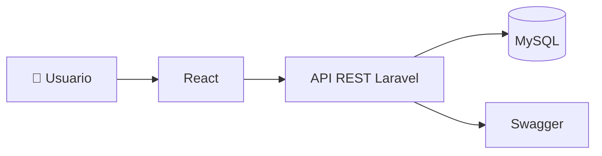
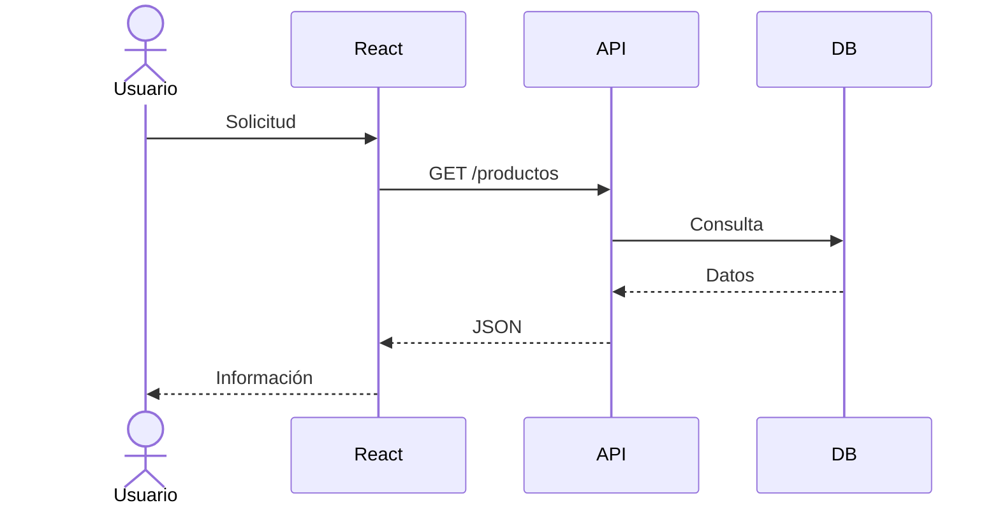

# 🌐 A08 - Auditoría de la API REST

## 📖 Descripción del Alcance

El presente alcance evalúa la implementación de la API REST del sistema **Tridente Store**, verificando que los servicios desarrollados permitan la comunicación eficiente entre el frontend y el backend, cumpliendo principios de interoperabilidad, seguridad, mantenibilidad y documentación.

La auditoría revisa el diseño de los endpoints, el uso adecuado de los métodos HTTP, el formato de intercambio de datos, la gestión de errores, la autenticación y la documentación mediante Swagger/OpenAPI.

---

# 🎯 Objetivo

Verificar que la API REST del sistema haya sido diseñada e implementada siguiendo buenas prácticas de desarrollo web, garantizando interoperabilidad, seguridad y facilidad de mantenimiento.

---

# 📌 Componentes Auditados

- Endpoints REST
- Métodos HTTP
- Respuestas JSON
- Swagger / OpenAPI
- Validaciones
- Autenticación
- Manejo de errores
- Consistencia de rutas
- Integración con React
- Seguridad de la API

---

# 🏗 Arquitectura Evaluada

---

# 📋 Checklist de Auditoría

| Código | Criterio Evaluado | Estado | Evidencia | Observación |
|---------|-------------------|:------:|-----------|-------------|
| API-01 | API REST implementada | ✅ | Laravel | Conforme |
| API-02 | Endpoints documentados | ✅ | Swagger | Conforme |
| API-03 | Uso correcto de GET | ✅ | Swagger | Conforme |
| API-04 | Uso correcto de POST | ✅ | Swagger | Conforme |
| API-05 | Uso correcto de PUT | ✅ | Swagger | Conforme |
| API-06 | Uso correcto de DELETE | ✅ | Swagger | Conforme |
| API-07 | Respuestas JSON | ✅ | API | Conforme |
| API-08 | Validaciones implementadas | ✅ | Laravel | Conforme |
| API-09 | Manejo de errores | ✅ | API | Conforme |
| API-10 | Integración React | ✅ | Sistema | Conforme |
| API-11 | Seguridad mediante middleware | ✅ | Laravel | Conforme |
| API-12 | Arquitectura consistente | ✅ | Documentación | Conforme |
| API-13 | Versionamiento de la API | ✅ | GitHub | Conforme |
| API-14 | Consistencia de rutas | ✅ | Laravel | Conforme |
| API-15 | Documentación actualizada | ✅ | MKDocs | Conforme |

---

# 📊 KPI

| Indicador | Resultado |
|------------|-----------:|
| Disponibilidad de Endpoints | 100% |
| Documentación | 100% |
| Integración | 100% |
| Seguridad | 100% |
| Consistencia | 100% |

---

# 📈 Flujo de Consumo de la API

---

# 📊 Nivel de Madurez

| Nivel | Estado |
|---------|:------:|
| Inicial | ✅ |
| Gestionado | ✅ |
| Definido | ✅ |
| Controlado | ✅ |
| Optimizado | 🟡 |

---

# ⚠️ Matriz de Riesgos

| Riesgo | Impacto | Probabilidad | Nivel |
|---------|----------|--------------|-------|
| Endpoint no documentado | Medio | Bajo | Bajo |
| Error en validaciones | Medio | Bajo | Bajo |
| Acceso no autorizado | Alto | Bajo | Medio |
| Cambios sin documentación | Medio | Bajo | Bajo |

---

# 🔎 Hallazgos

## Fortalezas

- API correctamente estructurada.
- Uso adecuado de métodos HTTP.
- Integración con React.
- Documentación mediante Swagger.
- Validaciones implementadas.
- Arquitectura REST consistente.

---

## No Conformidades

No se identificaron no conformidades críticas.

---

# 🛠 Acciones Correctivas

- Mantener actualizada la documentación Swagger.
- Versionar la API cuando existan cambios importantes.
- Revisar periódicamente los endpoints.

---

# 🚀 Acciones Preventivas

- Validar nuevos servicios antes de publicarlos.
- Documentar cada endpoint nuevo.
- Mantener consistencia en las respuestas JSON.

---

# 📑 Evidencias Revisadas

- Swagger UI
- API Laravel
- React
- GitHub
- Documentación MKDocs

---

# 🏁 Conclusión

La auditoría evidencia que la API REST implementada en **Tridente Store** cumple con los principios de interoperabilidad, mantenibilidad y documentación. La integración con React y la documentación mediante Swagger permiten facilitar el desarrollo y mantenimiento del sistema.

El alcance obtiene un **100% de cumplimiento**.

!!! success "Resultado del Alcance"

    La API REST cumple satisfactoriamente con los criterios establecidos para la auditoría técnica, garantizando una comunicación eficiente entre el frontend y el backend.