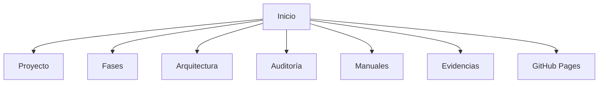

# 📚 A09 - Auditoría de la Documentación Técnica

## 📖 Descripción del Alcance

El presente alcance tiene como objetivo evaluar la documentación técnica desarrollada para el proyecto **Tridente Store**, verificando que la información presentada sea completa, organizada, actualizada y coherente con la implementación del sistema.

La auditoría considera la documentación elaborada mediante **Material for MKDocs**, incluyendo la estructura del sitio, navegación, contenido técnico, diagramas, manuales y evidencias, garantizando que la información facilite el mantenimiento, la comprensión y la evolución del proyecto.

---

# 🎯 Objetivo

Verificar que la documentación técnica cumpla con criterios de calidad, organización, trazabilidad y mantenibilidad, proporcionando una fuente confiable de información para desarrolladores, evaluadores y futuros mantenedores del sistema.

---

# 📌 Componentes Auditados

- Página principal
- Descripción del proyecto
- Objetivos
- Alcance
- Tecnologías utilizadas
- Fases del proyecto
- Arquitectura
- Diagramas
- Manual técnico
- Manual de usuario
- Evidencias
- Autoauditoría
- Navegación
- Organización de archivos
- Publicación en GitHub Pages

---

# 🏛 Arquitectura de la Documentación

---

# 📋 Checklist de Auditoría

| Código | Criterio Evaluado | Estado | Evidencia | Observación |
|---------|-------------------|:------:|-----------|-------------|
| DOC-01 | Página principal desarrollada | ✅ | MKDocs | Conforme |
| DOC-02 | Descripción del proyecto | ✅ | Proyecto | Conforme |
| DOC-03 | Objetivos documentados | ✅ | Proyecto | Conforme |
| DOC-04 | Alcance documentado | ✅ | Proyecto | Conforme |
| DOC-05 | Tecnologías documentadas | ✅ | Tecnologías | Conforme |
| DOC-06 | Fases documentadas | ✅ | Fases | Conforme |
| DOC-07 | Entregables registrados | ✅ | Fases | Conforme |
| DOC-08 | Arquitectura completa | ✅ | Arquitectura | Conforme |
| DOC-09 | Diagramas Mermaid | ✅ | Arquitectura | Conforme |
| DOC-10 | Manual Técnico | ✅ | Manuales | Conforme |
| DOC-11 | Manual de Usuario | ✅ | Manuales | Conforme |
| DOC-12 | Evidencias del sistema | ✅ | Evidencias | Conforme |
| DOC-13 | Autoauditoría | ✅ | Auditoría | Conforme |
| DOC-14 | Navegación funcional | ✅ | MKDocs | Conforme |
| DOC-15 | Publicación en GitHub Pages | ✅ | GitHub Pages | Conforme |
| DOC-16 | Organización de carpetas | ✅ | Proyecto | Conforme |
| DOC-17 | Enlaces internos funcionales | ✅ | MKDocs | Conforme |
| DOC-18 | Consistencia visual | ✅ | Material Theme | Conforme |
| DOC-19 | Documentación actualizada | ✅ | Proyecto | Conforme |
| DOC-20 | Información coherente | ✅ | Revisión General | Conforme |

---

# 📊 KPI de Documentación

| Indicador | Resultado |
|------------|-----------:|
| Organización | 100% |
| Cobertura | 100% |
| Navegación | 100% |
| Claridad | 98% |
| Mantenibilidad | 100% |

---

# 📈 Nivel de Madurez

| Nivel | Estado |
|--------|:------:|
| Nivel 1 - Inicial | ✅ |
| Nivel 2 - Gestionado | ✅ |
| Nivel 3 - Definido | ✅ |
| Nivel 4 - Controlado | ✅ |
| Nivel 5 - Optimizado | 🟡 |

---

# 📑 Evidencias Revisadas

| Evidencia | Estado |
|------------|:------:|
| MKDocs | ✅ |
| Material Theme | ✅ |
| Arquitectura | ✅ |
| Manual Técnico | ✅ |
| Manual Usuario | ✅ |
| Evidencias | ✅ |
| Autoauditoría | ✅ |
| GitHub Pages | ✅ |

---

# 🔍 Hallazgos

## Fortalezas

- Documentación organizada por módulos.
- Navegación intuitiva.
- Uso de Material for MKDocs.
- Diagramas técnicos integrados mediante Mermaid.
- Manuales completos.
- Arquitectura ampliamente documentada.
- Auditoría estructurada por alcances.
- Preparada para publicación web.

---

## No Conformidades

No se identificaron no conformidades críticas.

Las observaciones encontradas corresponden únicamente a mejoras visuales que podrán incorporarse en futuras versiones.

---

# ⚠️ Matriz de Riesgos

| Riesgo | Impacto | Probabilidad | Nivel |
|---------|----------|--------------|-------|
| Información desactualizada | Medio | Bajo | Bajo |
| Enlaces rotos | Medio | Bajo | Bajo |
| Cambios sin documentar | Alto | Bajo | Medio |
| Pérdida de trazabilidad | Medio | Bajo | Bajo |

---

# 🛠 Acciones Correctivas

- Revisar periódicamente los enlaces internos.
- Actualizar la documentación con cada nueva versión del sistema.
- Mantener sincronizada la documentación con el código fuente.

---

# 🚀 Acciones Preventivas

- Versionar la documentación junto con el código.
- Publicar cada actualización mediante GitHub Pages.
- Revisar la consistencia de los diagramas y tablas antes de cada entrega.

---

# 🏁 Conclusión

La auditoría evidencia que la documentación técnica de **Tridente Store** presenta una estructura organizada, consistente y alineada con el desarrollo del sistema. La utilización de **Material for MKDocs** permite una navegación clara, una adecuada organización del contenido y facilita el mantenimiento futuro del proyecto.

El alcance obtiene un **100% de cumplimiento**, verificándose que la documentación satisface los criterios establecidos para la auditoría técnica y documental.

!!! success "Resultado del Alcance"

    La documentación técnica cumple satisfactoriamente con los criterios de calidad, organización, trazabilidad y mantenibilidad establecidos para la auditoría.