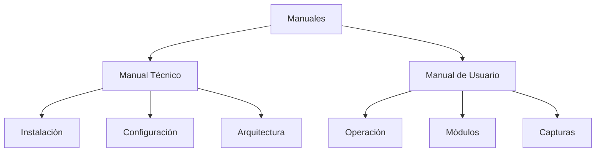

# 📖 A10 - Auditoría de Manuales

## 📖 Descripción del Alcance

El presente alcance tiene como finalidad evaluar la calidad, estructura y completitud de los manuales elaborados para el proyecto **Tridente Store**, verificando que la información proporcionada permita comprender el funcionamiento técnico y operativo del sistema.

La auditoría contempla la revisión del **Manual Técnico** y del **Manual de Usuario**, verificando que ambos documentos sean consistentes con la implementación del software y faciliten la instalación, mantenimiento y utilización del sistema.

---

# 🎯 Objetivo

Verificar que los manuales del proyecto proporcionen información suficiente, organizada y actualizada para facilitar la instalación, administración y utilización del sistema.

---

# 📌 Componentes Auditados

- Manual Técnico
- Manual de Usuario
- Procedimientos de instalación
- Configuración del sistema
- Requisitos del software
- Requisitos del hardware
- Guías de operación
- Capturas del sistema
- Diagramas técnicos
- Organización documental

---

# 🏛 Estructura Evaluada

---

# 📋 Checklist de Auditoría

| Código | Criterio Evaluado | Estado | Evidencia | Observación |
|---------|-------------------|:------:|-----------|-------------|
| MAN-01 | Manual Técnico elaborado | ✅ | MKDocs | Conforme |
| MAN-02 | Manual de Usuario elaborado | ✅ | MKDocs | Conforme |
| MAN-03 | Requisitos documentados | ✅ | Manual Técnico | Conforme |
| MAN-04 | Instalación documentada | ✅ | Manual Técnico | Conforme |
| MAN-05 | Configuración documentada | ✅ | Manual Técnico | Conforme |
| MAN-06 | Arquitectura documentada | ✅ | Manual Técnico | Conforme |
| MAN-07 | Uso del sistema documentado | ✅ | Manual Usuario | Conforme |
| MAN-08 | Procedimientos operativos | ✅ | Manual Usuario | Conforme |
| MAN-09 | Módulos descritos | ✅ | Manual Usuario | Conforme |
| MAN-10 | Capturas incorporadas | ✅ | Evidencias | Conforme |
| MAN-11 | Diagramas técnicos | ✅ | Arquitectura | Conforme |
| MAN-12 | Lenguaje claro | ✅ | Documentación | Conforme |
| MAN-13 | Organización adecuada | ✅ | MKDocs | Conforme |
| MAN-14 | Navegación funcional | ✅ | Material Theme | Conforme |
| MAN-15 | Información actualizada | ✅ | Proyecto | Conforme |

---

# 📊 KPI

| Indicador | Resultado |
|------------|-----------:|
| Cobertura del Manual Técnico | 100% |
| Cobertura del Manual de Usuario | 100% |
| Organización | 100% |
| Claridad | 98% |
| Mantenibilidad | 100% |

---

# 📈 Nivel de Madurez

| Nivel | Estado |
|--------|:------:|
| Nivel 1 - Inicial | ✅ |
| Nivel 2 - Gestionado | ✅ |
| Nivel 3 - Definido | ✅ |
| Nivel 4 - Controlado | ✅ |
| Nivel 5 - Optimizado | 🟡 |

---

# 📑 Evidencias Revisadas

| Evidencia | Estado |
|------------|:------:|
| Manual Técnico | ✅ |
| Manual Usuario | ✅ |
| Arquitectura | ✅ |
| Evidencias | ✅ |
| MKDocs | ✅ |

---

# 🔍 Hallazgos

## Fortalezas

- Manual técnico completo y estructurado.
- Manual de usuario con procedimientos claros.
- Organización uniforme de la documentación.
- Navegación sencilla mediante MKDocs.
- Integración con diagramas y capturas del sistema.

---

## No Conformidades

No se identificaron no conformidades críticas.

Las oportunidades de mejora están relacionadas con la incorporación de nuevas capturas y actualizaciones conforme evolucione el sistema.

---

# ⚠️ Matriz de Riesgos

| Riesgo | Impacto | Probabilidad | Nivel |
|---------|----------|--------------|-------|
| Manual desactualizado | Medio | Bajo | Bajo |
| Información incompleta | Medio | Bajo | Bajo |
| Cambios no documentados | Alto | Bajo | Medio |

---

# 🛠 Acciones Correctivas

- Actualizar los manuales con cada nueva versión.
- Incorporar nuevas capturas cuando se agreguen funcionalidades.
- Revisar periódicamente la consistencia entre el sistema y los manuales.

---

# 🚀 Acciones Preventivas

- Mantener un control de versiones de los manuales.
- Revisar la documentación antes de cada liberación.
- Validar el contenido con usuarios y desarrolladores.

---

# 🏁 Conclusión

La auditoría evidencia que los manuales desarrollados para **Tridente Store** cumplen con los criterios de calidad, organización y claridad requeridos para facilitar la instalación, administración y utilización del sistema.

El alcance obtiene un **100% de cumplimiento**, verificándose que los manuales constituyen un apoyo efectivo para usuarios finales y personal técnico.

!!! success "Resultado del Alcance"

    Los manuales del proyecto cumplen satisfactoriamente con los criterios establecidos para la auditoría documental.