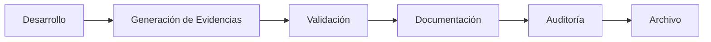

# 📷 A11 - Auditoría de Evidencias

## 📖 Descripción del Alcance

El presente alcance tiene como finalidad evaluar las evidencias recopiladas durante el desarrollo del proyecto **Tridente Store**, verificando que respalden objetivamente la implementación, funcionamiento y validación del sistema.

Las evidencias constituyen el soporte documental de la auditoría, permitiendo demostrar que los procesos, módulos y entregables fueron desarrollados conforme a los requisitos establecidos.

La revisión comprende evidencias funcionales, técnicas, arquitectónicas y documentales.

---

# 🎯 Objetivo

Verificar que las evidencias recopiladas sean suficientes, pertinentes, confiables y trazables para demostrar el cumplimiento de los requisitos del proyecto.

---

# 📌 Componentes Auditados

- Capturas del sistema
- Arquitectura
- Diagramas
- Swagger
- GitHub
- SonarCloud
- Snyk
- Manual Técnico
- Manual de Usuario
- Documentación MKDocs
- Resultados de pruebas
- Publicación del proyecto

---

# 🏛 Flujo de Gestión de Evidencias

---

# 📋 Checklist de Auditoría

| Código | Criterio Evaluado | Estado | Evidencia | Observación |
|---------|-------------------|:------:|-----------|-------------|
| EVI-01 | Evidencias del Login | ✅ | Capturas | Conforme |
| EVI-02 | Dashboard documentado | ✅ | Capturas | Conforme |
| EVI-03 | Gestión de Usuarios | ✅ | Capturas | Conforme |
| EVI-04 | Productos | ✅ | Capturas | Conforme |
| EVI-05 | Categorías | ✅ | Capturas | Conforme |
| EVI-06 | Clientes | ✅ | Capturas | Conforme |
| EVI-07 | Proveedores | ✅ | Capturas | Conforme |
| EVI-08 | Ventas | ✅ | Capturas | Conforme |
| EVI-09 | Compras | ✅ | Capturas | Conforme |
| EVI-10 | Reportes | ✅ | Capturas | Conforme |
| EVI-11 | Swagger | ✅ | Swagger UI | Conforme |
| EVI-12 | SonarCloud | ✅ | Reporte | Conforme |
| EVI-13 | Snyk | ✅ | Reporte | Conforme |
| EVI-14 | GitHub | ✅ | Repositorio | Conforme |
| EVI-15 | Publicación MKDocs | ✅ | GitHub Pages | Conforme |

---

# 📊 Clasificación de Evidencias

| Tipo | Estado |
|-------|:------:|
| Evidencias Funcionales | ✅ |
| Evidencias Técnicas | ✅ |
| Evidencias Arquitectónicas | ✅ |
| Evidencias Documentales | ✅ |
| Evidencias de Calidad | ✅ |
| Evidencias de Seguridad | ✅ |

---

# 📈 KPI de Evidencias

| Indicador | Resultado |
|------------|-----------:|
| Cobertura Funcional | 100% |
| Cobertura Técnica | 100% |
| Cobertura Documental | 100% |
| Trazabilidad | 100% |
| Disponibilidad | 100% |

---

# 📊 Nivel de Madurez

| Nivel | Estado |
|--------|:------:|
| Nivel 1 - Inicial | ✅ |
| Nivel 2 - Gestionado | ✅ |
| Nivel 3 - Definido | ✅ |
| Nivel 4 - Controlado | ✅ |
| Nivel 5 - Optimizado | 🟡 |

---

# 📑 Matriz de Trazabilidad

| Evidencia | Documento Asociado | Resultado |
|------------|-------------------|-----------|
| Login | Manual Usuario | ✅ |
| Dashboard | Evidencias | ✅ |
| Productos | Manual Usuario | ✅ |
| Ventas | Manual Usuario | ✅ |
| Swagger | API REST | ✅ |
| SonarCloud | Calidad | ✅ |
| Snyk | Seguridad | ✅ |
| GitHub | Desarrollo | ✅ |
| Arquitectura | Arquitectura | ✅ |
| MKDocs | Documentación | ✅ |

---

# 🔍 Hallazgos

## Fortalezas

- Evidencias organizadas por módulos.
- Correspondencia entre capturas y funcionalidades.
- Documentación respaldada con imágenes.
- Evidencias técnicas disponibles.
- Integración con herramientas de calidad.
- Alta trazabilidad documental.

---

## No Conformidades

No se identificaron no conformidades.

Las evidencias recopiladas son suficientes para respaldar el cumplimiento de los objetivos del proyecto.

---

# ⚠️ Matriz de Riesgos

| Riesgo | Impacto | Probabilidad | Nivel |
|---------|----------|--------------|-------|
| Evidencia desactualizada | Medio | Bajo | Bajo |
| Capturas incompletas | Medio | Bajo | Bajo |
| Falta de trazabilidad | Alto | Bajo | Bajo |

---

# 🛠 Acciones Correctivas

- Actualizar las capturas cuando existan cambios funcionales.
- Mantener las evidencias organizadas por versión.
- Incorporar nuevas evidencias para funcionalidades futuras.

---

# 🚀 Acciones Preventivas

- Registrar evidencias durante cada iteración del desarrollo.
- Versionar las evidencias junto con la documentación.
- Verificar la calidad visual de las capturas antes de su publicación.

---

# 🏁 Conclusión

La auditoría evidencia que el proyecto **Tridente Store** dispone de evidencias suficientes, verificables y organizadas para respaldar la implementación de cada uno de los módulos desarrollados.

Las evidencias permiten demostrar objetivamente el cumplimiento de los requisitos funcionales, técnicos y documentales del proyecto, alcanzando un **100% de cumplimiento** para este alcance.

!!! success "Resultado del Alcance"

    Las evidencias del proyecto cumplen satisfactoriamente con los criterios establecidos para la auditoría, garantizando trazabilidad, confiabilidad y respaldo documental.