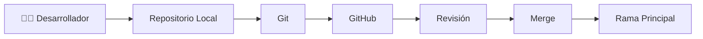
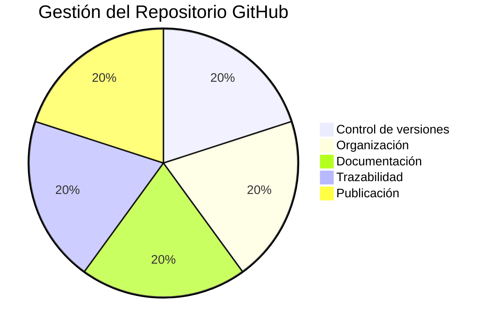

# 🐙 A12 - Auditoría del Control de Versiones y Repositorio GitHub

## 📖 Descripción del Alcance

El presente alcance tiene como finalidad evaluar la gestión del código fuente del proyecto **Tridente Store**, verificando que el repositorio GitHub permita garantizar la trazabilidad, integridad, organización y evolución del software durante todo su ciclo de desarrollo.

La auditoría comprende la revisión de la estructura del repositorio, el uso del sistema de control de versiones Git, la organización de ramas, la calidad de los commits, la documentación asociada y la gestión de cambios implementada durante el proyecto.

---

# 🎯 Objetivo

Verificar que el control de versiones del proyecto garantice una adecuada administración del código fuente, permitiendo mantener la integridad, trazabilidad y evolución del software.

---

# 📌 Componentes Auditados

- Repositorio GitHub
- Git
- Commits
- Branches
- Historial de cambios
- Versionamiento
- Releases
- Documentación
- Pull Requests
- Gestión de incidencias

---

# 🏛 Flujo de Control de Versiones

---

# 📋 Checklist de Auditoría

| Código | Criterio Evaluado | Estado | Evidencia | Observación |
|---------|-------------------|:------:|-----------|-------------|
| GIT-01 | Repositorio GitHub creado | ✅ | GitHub | Conforme |
| GIT-02 | Control de versiones implementado | ✅ | Git | Conforme |
| GIT-03 | Historial de commits | ✅ | GitHub | Conforme |
| GIT-04 | Organización del proyecto | ✅ | Repositorio | Conforme |
| GIT-05 | Uso de ramas | ✅ | GitHub | Conforme |
| GIT-06 | Versionamiento del proyecto | ✅ | Git | Conforme |
| GIT-07 | Documentación incluida | ✅ | MKDocs | Conforme |
| GIT-08 | Código organizado | ✅ | Repositorio | Conforme |
| GIT-09 | Integración con Swagger | ✅ | Proyecto | Conforme |
| GIT-10 | Integración con SonarCloud | ✅ | SonarCloud | Conforme |
| GIT-11 | Integración con Snyk | ✅ | Snyk | Conforme |
| GIT-12 | Publicación mediante GitHub Pages | ✅ | GitHub Pages | Conforme |
| GIT-13 | Trazabilidad de cambios | ✅ | Historial Git | Conforme |
| GIT-14 | Estructura de carpetas organizada | ✅ | Repositorio | Conforme |
| GIT-15 | Disponibilidad del repositorio | ✅ | GitHub | Conforme |

---

# 📊 KPI de Gestión del Código Fuente

| Indicador | Resultado |
|------------|-----------:|
| Control de Versiones | 100% |
| Organización del Repositorio | 100% |
| Trazabilidad | 100% |
| Disponibilidad | 100% |
| Documentación | 100% |

---

# 📈 Nivel de Madurez

| Nivel | Estado |
|--------|:------:|
| Nivel 1 - Inicial | ✅ |
| Nivel 2 - Gestionado | ✅ |
| Nivel 3 - Definido | ✅ |
| Nivel 4 - Controlado | ✅ |
| Nivel 5 - Optimización Continua | 🟡 |

---

# 📑 Evidencias Revisadas

| Evidencia | Estado |
|------------|:------:|
| Repositorio GitHub | ✅ |
| Historial de Commits | ✅ |
| Branches | ✅ |
| Documentación MKDocs | ✅ |
| Swagger | ✅ |
| SonarCloud | ✅ |
| Snyk | ✅ |
| GitHub Pages | ✅ |

---

# 📊 Indicadores de Gestión

---

# 🔍 Hallazgos

## Fortalezas

- Uso adecuado de Git como sistema de control de versiones.
- Repositorio organizado.
- Historial de cambios disponible.
- Integración con herramientas de calidad.
- Publicación mediante GitHub Pages.
- Documentación sincronizada con el desarrollo.
- Alta trazabilidad de cambios.

---

## No Conformidades

No se identificaron no conformidades críticas durante la auditoría.

Las observaciones realizadas corresponden únicamente a mejoras de evolución continua.

---

# ⚠️ Matriz de Riesgos

| Riesgo | Impacto | Probabilidad | Nivel |
|---------|----------|--------------|-------|
| Pérdida del repositorio | Alto | Bajo | Medio |
| Commits sin documentación | Medio | Bajo | Bajo |
| Conflictos de ramas | Medio | Bajo | Bajo |
| Cambios sin revisión | Alto | Bajo | Medio |

---

# 🛠 Acciones Correctivas

- Mantener una política de commits descriptivos.
- Versionar cada nueva funcionalidad.
- Revisar periódicamente la estructura del repositorio.
- Mantener sincronizada la documentación con el código.

---

# 🚀 Acciones Preventivas

- Utilizar Pull Requests para cambios importantes.
- Documentar nuevas versiones mediante Releases.
- Realizar respaldos del repositorio.
- Mantener ramas organizadas según la estrategia de desarrollo.

---

# 🏁 Conclusión

La auditoría evidencia que el proyecto **Tridente Store** utiliza adecuadamente Git y GitHub como mecanismos de control de versiones, garantizando la trazabilidad de los cambios, la organización del código fuente y la disponibilidad del proyecto para futuros desarrollos.

El alcance obtiene un **100% de cumplimiento**, demostrando una correcta gestión del repositorio y una adecuada integración con las herramientas utilizadas durante el desarrollo.

!!! success "Resultado del Alcance"

    La gestión del código fuente y del repositorio GitHub cumple satisfactoriamente con los criterios establecidos para la auditoría, garantizando trazabilidad, organización y control de versiones.