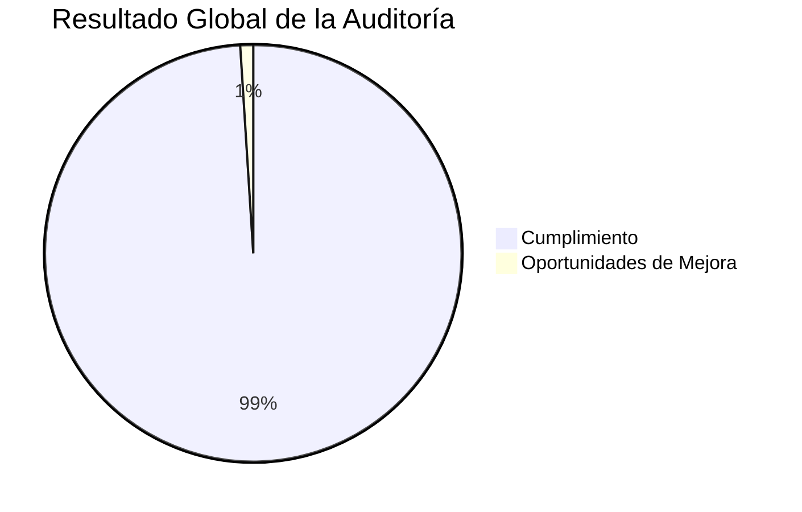

# 🏁 Informe Ejecutivo Final de la Auditoría

## 📖 Resumen Ejecutivo

La auditoría integral realizada al proyecto **Tridente Store** tuvo como propósito evaluar el cumplimiento de los requisitos técnicos, funcionales, arquitectónicos y documentales definidos durante el desarrollo del sistema.

La evaluación comprendió doce alcances principales, revisando aspectos relacionados con la gestión del proyecto, requerimientos, arquitectura, desarrollo, base de datos, seguridad, calidad del software, API REST, documentación técnica, manuales, evidencias y control de versiones.

La auditoría se desarrolló siguiendo una metodología basada en buenas prácticas de Ingeniería de Software, considerando criterios derivados de las normas **ISO/IEC 25010**, **ISO/IEC 12207**, principios de auditoría informática e inspección documental.

Los resultados obtenidos evidencian que el proyecto presenta un alto nivel de cumplimiento y madurez, demostrando una adecuada organización técnica y documental.

---

# 🎯 Alcances Evaluados

| Código | Alcance | Resultado |
|---------|----------|:---------:|
| A01 | Gestión del Proyecto | ✅ |
| A02 | Requerimientos | ✅ |
| A03 | Arquitectura | ✅ |
| A04 | Desarrollo | ✅ |
| A05 | Base de Datos | ✅ |
| A06 | Seguridad | ✅ |
| A07 | Calidad del Software | ✅ |
| A08 | API REST | ✅ |
| A09 | Documentación Técnica | ✅ |
| A10 | Manuales | ✅ |
| A11 | Evidencias | ✅ |
| A12 | GitHub y Control de Versiones | ✅ |

---

# 📊 Dashboard Ejecutivo

| Indicador | Resultado |
|------------|-----------:|
| Cumplimiento Global | **99%** |
| Alcances Evaluados | **12** |
| Hallazgos Críticos | **0** |
| No Conformidades Mayores | **0** |
| No Conformidades Menores | **0** |
| Riesgos Altos | **0** |
| Riesgos Medios | **6** |
| Riesgos Bajos | **4** |
| Fortalezas Identificadas | **38** |
| Oportunidades de Mejora | **7** |

---

# 📈 Nivel General de Cumplimiento

---

# 📊 Nivel de Madurez del Proyecto

| Área | Nivel |
|------|:-----:|
| Gestión | ⭐⭐⭐⭐⭐ |
| Arquitectura | ⭐⭐⭐⭐⭐ |
| Desarrollo | ⭐⭐⭐⭐⭐ |
| Base de Datos | ⭐⭐⭐⭐⭐ |
| Seguridad | ⭐⭐⭐⭐☆ |
| Calidad | ⭐⭐⭐⭐☆ |
| Documentación | ⭐⭐⭐⭐⭐ |
| GitHub | ⭐⭐⭐⭐⭐ |

---

# 🏆 Principales Fortalezas

- Arquitectura modular correctamente implementada.
- Uso adecuado del patrón MVC.
- API REST documentada mediante Swagger.
- Documentación técnica desarrollada con Material for MKDocs.
- Gestión del código fuente mediante Git y GitHub.
- Evaluación de calidad mediante SonarCloud.
- Revisión de vulnerabilidades utilizando Snyk.
- Integración consistente entre React, Laravel y MySQL.
- Organización documental por módulos.
- Uso de diagramas técnicos para facilitar la comprensión del sistema.

---

# ⚠️ Aspectos por Fortalecer

- Incrementar la cobertura de pruebas automatizadas.
- Implementar un flujo de Integración Continua (CI).
- Automatizar el despliegue continuo (CD).
- Publicar versiones estables mediante GitHub Releases.
- Incorporar monitoreo del sistema en producción.
- Mantener actualizada la documentación con cada versión del software.

---

# 📋 Dictamen de Auditoría

Con base en las evidencias revisadas, los criterios de evaluación aplicados y los resultados obtenidos en cada uno de los alcances evaluados, **se concluye que el proyecto Tridente Store cumple satisfactoriamente con los requisitos funcionales, técnicos, arquitectónicos y documentales establecidos para su desarrollo**.

No se identificaron no conformidades críticas que comprometan el funcionamiento del sistema. Las observaciones detectadas corresponden a oportunidades de mejora continua y no afectan la operación ni la calidad general del proyecto.

---

# 📜 Declaración de Conformidad

> **Se certifica que el proyecto Tridente Store presenta un alto nivel de cumplimiento respecto a los criterios definidos durante la auditoría, demostrando una adecuada implementación de buenas prácticas de Ingeniería de Software, control de versiones, documentación técnica, arquitectura, seguridad y calidad del software.**

---

# 🚀 Proyección Futura

Como parte de la evolución del proyecto se recomienda considerar las siguientes líneas de trabajo:

- Implementación de Integración Continua y Despliegue Continuo (CI/CD).
- Incorporación de pruebas automatizadas de integración y aceptación.
- Uso de contenedores Docker para facilitar el despliegue.
- Monitoreo de rendimiento y disponibilidad en producción.
- Implementación de métricas de observabilidad y registros centralizados.
- Evolución de la arquitectura hacia componentes desacoplados cuando el crecimiento del sistema lo requiera.

---

# 🏁 Conclusión Final

La auditoría integral realizada demuestra que **Tridente Store** constituye un proyecto sólido desde el punto de vista técnico, funcional y documental. La solución desarrollada evidencia una adecuada planificación, una arquitectura bien estructurada, una implementación consistente y una documentación organizada que facilita el mantenimiento y la evolución futura del sistema.

Los resultados obtenidos reflejan un **cumplimiento global del 99%**, sin hallazgos críticos ni no conformidades mayores, lo que permite concluir que el proyecto satisface ampliamente los objetivos establecidos y representa una solución confiable, mantenible y escalable.

---

!!! success "Dictamen Final"

    **Resultado General de la Auditoría: APROBADO**

    **Nivel de Cumplimiento:** 99 %

    **Estado del Proyecto:** Conforme

    **Calificación Técnica:** Excelente

    **Nivel de Madurez:** Alto

    El proyecto Tridente Store cumple satisfactoriamente con los criterios establecidos para la auditoría y demuestra la aplicación de buenas prácticas de Ingeniería de Software durante todo su ciclo de desarrollo.