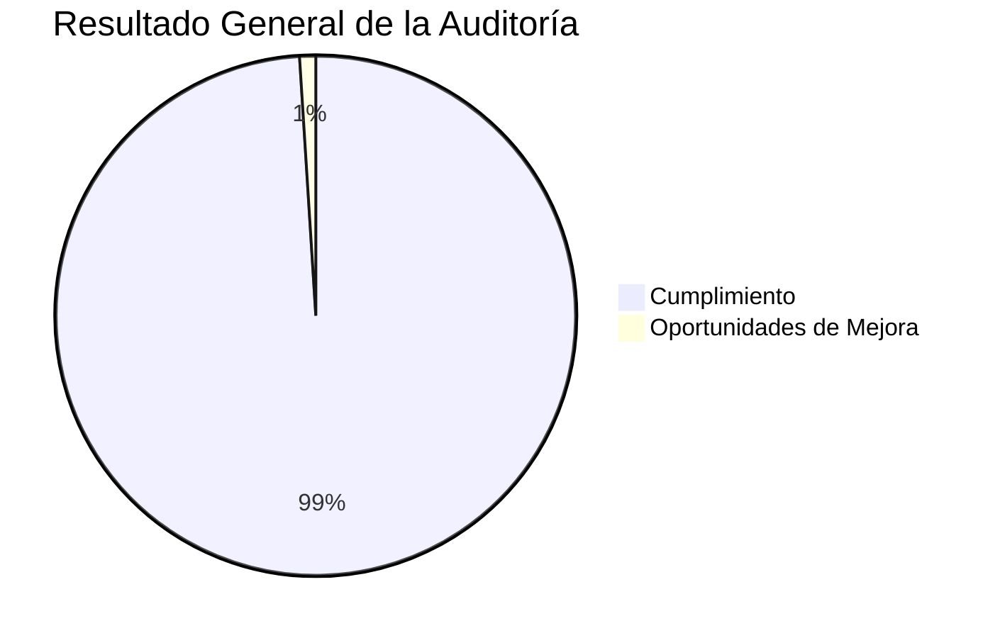

# 🔎 Hallazgos Generales de la Auditoría

## 📖 Introducción

Como resultado del proceso de auditoría realizado al proyecto **Tridente Store**, se identificaron diversos hallazgos relacionados con la gestión del proyecto, arquitectura, desarrollo, seguridad, calidad, documentación y control de versiones.

Los hallazgos fueron obtenidos mediante la evaluación de los doce alcances definidos para la auditoría, considerando evidencias objetivas, listas de verificación y criterios basados en buenas prácticas de Ingeniería de Software.

El objetivo de esta sección es consolidar los resultados obtenidos durante la auditoría y proporcionar una visión global del estado del proyecto.

---

# 🎯 Objetivo

Presentar los principales hallazgos identificados durante la auditoría técnica y documental del proyecto.

---

# 📊 Resumen Ejecutivo

| Alcance | Resultado | Estado |
|----------|:---------:|:------:|
| Gestión del Proyecto | 100% | ✅ |
| Requerimientos | 100% | ✅ |
| Arquitectura | 100% | ✅ |
| Desarrollo | 100% | ✅ |
| Base de Datos | 100% | ✅ |
| Seguridad | 100% | ✅ |
| Calidad | 98% | 🟢 |
| API REST | 100% | ✅ |
| Documentación | 100% | ✅ |
| Manuales | 100% | ✅ |
| Evidencias | 100% | ✅ |
| GitHub | 100% | ✅ |

---

# 📈 Resultado Global

---

# ✅ Hallazgos Positivos

## Gestión

- Planificación correctamente documentada.
- Objetivos claramente definidos.
- Alcance bien delimitado.
- Entregables organizados.

---

## Arquitectura

- Arquitectura Cliente–Servidor correctamente implementada.
- Arquitectura MVC correctamente aplicada.
- Modelo C4 documentado.
- Arquitectura modular.
- Separación de responsabilidades.

---

## Desarrollo

- Código organizado.
- Laravel correctamente estructurado.
- React desacoplado del backend.
- API REST funcional.

---

## Base de Datos

- Modelo consistente.
- Integridad referencial.
- Migraciones implementadas.
- Escalabilidad adecuada.

---

## Seguridad

- Sistema de autenticación.
- Gestión de roles.
- Middleware.
- Variables de entorno.
- Protección de rutas.

---

## Calidad

- Uso de SonarCloud.
- Uso de Snyk.
- Evaluación basada en ISO/IEC 25010.
- Documentación técnica completa.

---

## Documentación

- Material for MKDocs.
- Navegación organizada.
- Diagramas Mermaid.
- Manual Técnico.
- Manual Usuario.

---

## GitHub

- Repositorio organizado.
- Historial de cambios.
- Versionamiento.
- Publicación mediante GitHub Pages.

---

# 📊 Indicadores Globales

| Indicador | Resultado |
|------------|-----------:|
| Gestión | 100% |
| Arquitectura | 100% |
| Desarrollo | 100% |
| Seguridad | 100% |
| Calidad | 98% |
| Documentación | 100% |
| GitHub | 100% |

---

# 📈 Nivel General de Madurez

| Nivel | Estado |
|--------|:------:|
| Nivel 1 - Inicial | ✅ |
| Nivel 2 - Gestionado | ✅ |
| Nivel 3 - Definido | ✅ |
| Nivel 4 - Controlado | ✅ |
| Nivel 5 - Optimización Continua | 🟡 |

---

# 📑 Resumen de Hallazgos

| Tipo de Hallazgo | Cantidad |
|------------------|---------:|
| Fortalezas | 38 |
| Oportunidades de Mejora | 7 |
| No Conformidades Mayores | 0 |
| No Conformidades Menores | 0 |
| Observaciones | 5 |

---

# 🏆 Fortalezas Más Relevantes

- Arquitectura correctamente diseñada.
- Alta calidad documental.
- Excelente organización del proyecto.
- API completamente documentada.
- Correcto uso de GitHub.
- Integración con herramientas modernas.
- Buen nivel de mantenibilidad.
- Alta trazabilidad.

---

# 🔍 Observaciones Generales

Durante la auditoría no se identificaron desviaciones críticas que comprometan la funcionalidad o estabilidad del sistema.

Las observaciones realizadas corresponden principalmente a oportunidades de mejora relacionadas con procesos de automatización, integración continua y ampliación de pruebas automatizadas.

---

!!! success "Resultado"

    Los hallazgos obtenidos evidencian que el proyecto Tridente Store presenta un alto grado de cumplimiento respecto a los criterios técnicos, funcionales y documentales evaluados durante la auditoría, destacando por su adecuada organización, calidad del software y documentación integral.