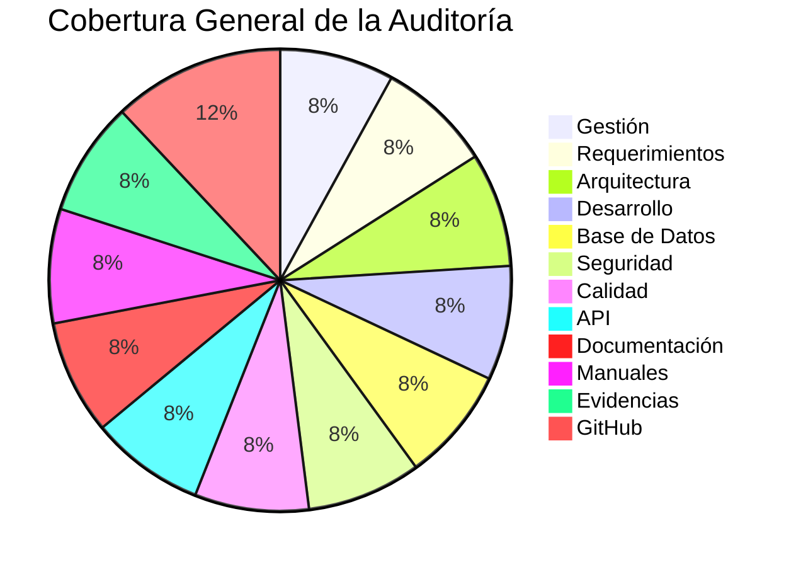

# 📋 Autoauditoría del Proyecto

## 📖 Introducción

La presente autoauditoría tiene como propósito evaluar el grado de cumplimiento del proyecto **Tridente Store** respecto a los requisitos funcionales, técnicos, arquitectónicos y documentales definidos durante su desarrollo.

La evaluación fue realizada considerando las buenas prácticas de Ingeniería de Software y tomando como referencia estándares internacionales como **ISO/IEC 12207**, **ISO/IEC 25010**, principios de arquitectura de software y criterios de calidad aplicados durante el ciclo de vida del desarrollo.

La auditoría permite identificar fortalezas, verificar el cumplimiento de los entregables y establecer oportunidades de mejora para futuras versiones del sistema.

---

# 🎯 Objetivos

## Objetivo General

Evaluar integralmente el proyecto Tridente Store mediante una auditoría técnica y documental, verificando el cumplimiento de los requisitos establecidos durante el desarrollo.

## Objetivos Específicos

- Verificar el cumplimiento de los entregables del proyecto.
- Evaluar la calidad del software desarrollado.
- Revisar la arquitectura implementada.
- Analizar la documentación técnica.
- Validar el cumplimiento de las buenas prácticas de Ingeniería de Software.
- Identificar oportunidades de mejora.

---

# 📌 Alcance General

La auditoría comprende la evaluación de los siguientes componentes del proyecto.

| Código | Alcance | Estado |
|---------|----------|:------:|
| A01 | Gestión del Proyecto | ✅ |
| A02 | Requerimientos | ✅ |
| A03 | Arquitectura | ✅ |
| A04 | Desarrollo | ✅ |
| A05 | Base de Datos | ✅ |
| A06 | Seguridad | ✅ |
| A07 | Calidad | ✅ |
| A08 | API REST | ✅ |
| A09 | Documentación | ✅ |
| A10 | Manuales | ✅ |
| A11 | Evidencias | ✅ |
| A12 | GitHub | ✅ |

---

# 🏛 Proceso General de Auditoría

---

# 📊 Resumen General

---

# 📚 Organización de la Auditoría

La auditoría se encuentra organizada en doce alcances principales, donde cada uno posee:

- Objetivo del alcance.
- Descripción.
- Lista de verificación (Checklist).
- Evidencias.
- Observaciones.
- Resultado.
- Nivel de cumplimiento.

---

!!! success "Resultado"

    La presente autoauditoría constituye el mecanismo de verificación utilizado para comprobar el cumplimiento técnico, funcional y documental del proyecto Tridente Store.