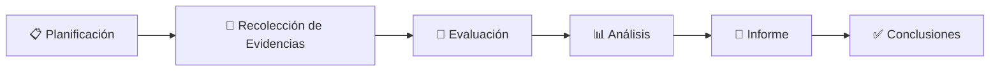
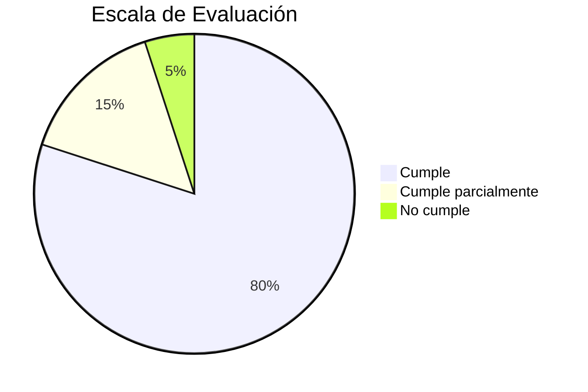

# 🏛 Metodología de la Auditoría

## 📖 Introducción

La presente auditoría fue desarrollada siguiendo una metodología sistemática orientada a verificar el cumplimiento de los requisitos técnicos, funcionales y documentales establecidos para el proyecto **Tridente Store**.

La metodología considera principios de auditoría informática, aseguramiento de la calidad del software y buenas prácticas de Ingeniería de Software, tomando como referencia las normas **ISO/IEC 12207**, **ISO/IEC 25010**, el ciclo de vida del software (SDLC) y criterios de revisión documental.

---

# 🎯 Objetivos de la Metodología

- Establecer el procedimiento de evaluación.
- Definir criterios objetivos de revisión.
- Garantizar la trazabilidad de la auditoría.
- Obtener resultados medibles.
- Identificar oportunidades de mejora.

---

# 📚 Normativa de Referencia

La auditoría toma como referencia las siguientes normas y buenas prácticas.

| Norma | Aplicación |
|---------|------------|
| ISO/IEC 12207 | Procesos del ciclo de vida del software |
| ISO/IEC 25010 | Modelo de calidad del software |
| IEEE 1012 | Verificación y validación |
| OWASP | Buenas prácticas de seguridad |
| GitHub Flow | Gestión del código fuente |
| OpenAPI | Documentación de servicios REST |

---

# 🧩 Tipo de Auditoría

| Tipo | Aplicación |
|--------|------------|
| Técnica | Evaluación del software |
| Funcional | Revisión del cumplimiento de requisitos |
| Arquitectónica | Evaluación de la arquitectura |
| Documental | Revisión de MKDocs |
| Calidad | Evaluación mediante SonarCloud y Snyk |

---

# 🔄 Metodología Aplicada

---

# 📋 Etapas de la Auditoría

## 1. Planificación

Durante esta etapa se definieron:

- Objetivos.
- Alcance.
- Documentación a revisar.
- Criterios de evaluación.

---

## 2. Recolección de Evidencias

Se recopilaron evidencias provenientes de:

- Código fuente.
- GitHub.
- Swagger.
- SonarCloud.
- Snyk.
- Capturas del sistema.
- Documentación MKDocs.

---

## 3. Evaluación

Cada componente fue evaluado mediante listas de verificación (Checklist) considerando:

- Cumple.
- Cumple parcialmente.
- No cumple.

---

## 4. Análisis

Se analizaron:

- Arquitectura.
- Calidad.
- Seguridad.
- Base de datos.
- API.
- Manuales.
- Documentación.

---

## 5. Elaboración del Informe

Los resultados fueron organizados por alcance para facilitar la interpretación de los hallazgos.

---

# 📊 Escala de Evaluación

| Valor | Interpretación |
|--------|----------------|
| ✅ Cumple | El criterio se cumple completamente |
| 🟡 Cumple Parcialmente | Existe implementación parcial |
| ❌ No Cumple | El criterio no fue implementado |

---

# 📈 Criterios de Cumplimiento

---

# 👥 Equipo Auditor

| Rol | Responsabilidad |
|------|-----------------|
| Auditor Principal | Evaluación integral del proyecto |
| Desarrollador | Presentación de evidencias |
| Revisor Técnico | Validación de la arquitectura |
| Responsable del Proyecto | Atención de observaciones |

---

# 📂 Evidencias Revisadas

- Documentación MKDocs.
- Código fuente.
- Repositorio GitHub.
- Swagger.
- SonarCloud.
- Snyk.
- Manual Técnico.
- Manual de Usuario.
- Evidencias del sistema.

---

# 🎯 Resultado Esperado

La metodología aplicada permite garantizar que la evaluación del proyecto sea objetiva, organizada, reproducible y basada en evidencias verificables.

---

!!! success "Resultado"

    La metodología aplicada proporciona un proceso estructurado para evaluar la calidad, arquitectura, seguridad, documentación y funcionamiento del proyecto Tridente Store, garantizando transparencia y trazabilidad durante toda la auditoría.