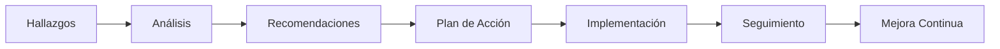
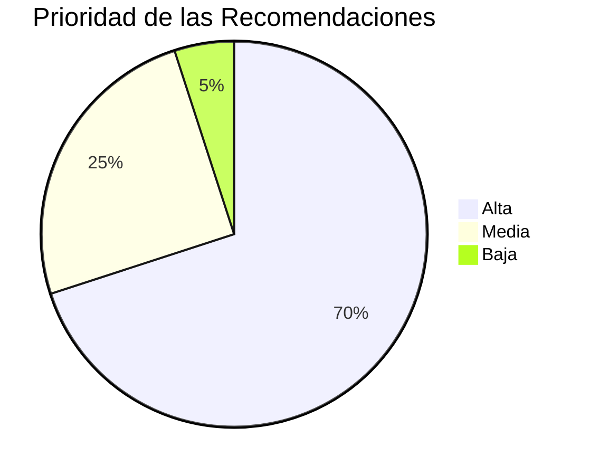

# 💡 Recomendaciones Generales de la Auditoría

## 📖 Introducción

Como resultado del proceso de auditoría realizado al proyecto **Tridente Store**, se formularon una serie de recomendaciones orientadas a fortalecer la calidad, seguridad, mantenibilidad y evolución del sistema.

Estas recomendaciones tienen como finalidad promover la mejora continua del proyecto, permitiendo incrementar su confiabilidad y facilitar futuras ampliaciones sin afectar la arquitectura existente.

Las recomendaciones se presentan clasificadas por área para facilitar su implementación y seguimiento.

---

# 🎯 Objetivo

Proponer acciones de mejora que permitan incrementar la calidad técnica, funcional y documental del proyecto Tridente Store.

---

# 📋 Plan General de Mejora

---

# 📊 Recomendaciones por Área

## 📂 Gestión del Proyecto

| Recomendación | Prioridad |
|---------------|:---------:|
| Mantener actualizado el cronograma del proyecto | Alta |
| Registrar formalmente los cambios del alcance | Media |
| Incorporar indicadores de seguimiento | Alta |
| Documentar retrospectivas del proyecto | Media |

---

## 🏛 Arquitectura

| Recomendación | Prioridad |
|---------------|:---------:|
| Mantener la arquitectura modular | Alta |
| Documentar nuevas decisiones arquitectónicas | Alta |
| Evaluar la adopción de microservicios en futuras versiones | Media |
| Mantener actualizado el Modelo C4 | Alta |

---

## 💻 Desarrollo

| Recomendación | Prioridad |
|---------------|:---------:|
| Incrementar la cobertura de pruebas unitarias | Alta |
| Aplicar revisiones de código entre desarrolladores | Alta |
| Automatizar pruebas de integración | Media |
| Mantener una guía de buenas prácticas de programación | Alta |

---

## 🗄 Base de Datos

| Recomendación | Prioridad |
|---------------|:---------:|
| Automatizar copias de seguridad | Alta |
| Revisar periódicamente los índices | Media |
| Optimizar consultas complejas | Media |
| Monitorear el crecimiento de la base de datos | Alta |

---

## 🔐 Seguridad

| Recomendación | Prioridad |
|---------------|:---------:|
| Ejecutar Snyk periódicamente | Alta |
| Rotar credenciales sensibles | Alta |
| Aplicar el principio de mínimo privilegio | Alta |
| Revisar permisos de usuarios | Media |

---

## 📊 Calidad

| Recomendación | Prioridad |
|---------------|:---------:|
| Ejecutar SonarCloud antes de cada liberación | Alta |
| Incorporar métricas automáticas de calidad | Media |
| Aumentar la cobertura de pruebas | Alta |
| Implementar integración continua (CI) | Alta |

---

## 🌐 API REST

| Recomendación | Prioridad |
|---------------|:---------:|
| Mantener Swagger actualizado | Alta |
| Versionar la API | Alta |
| Documentar nuevos endpoints | Alta |
| Mantener consistencia en las respuestas JSON | Media |

---

## 📚 Documentación

| Recomendación | Prioridad |
|---------------|:---------:|
| Actualizar MKDocs con cada nueva versión | Alta |
| Revisar enlaces internos | Media |
| Incorporar nuevos diagramas cuando existan cambios | Media |
| Mantener sincronizada la documentación con el código | Alta |

---

## 🐙 GitHub

| Recomendación | Prioridad |
|---------------|:---------:|
| Utilizar Pull Requests para cambios importantes | Alta |
| Publicar Releases oficiales | Media |
| Documentar los commits de manera descriptiva | Alta |
| Mantener organizada la estrategia de ramas | Alta |

---

# 📈 Priorización

---

# 🗓 Plan de Implementación

| Fase | Acción | Horizonte |
|------|--------|-----------|
| Corto Plazo | Actualización de documentación | 1 mes |
| Corto Plazo | Revisión de seguridad | 1 mes |
| Mediano Plazo | Automatización de pruebas | 3 meses |
| Mediano Plazo | Integración Continua | 3 meses |
| Largo Plazo | Evolución arquitectónica | 6 meses |

---

# 🎯 Beneficios Esperados

- Incremento de la calidad del software.
- Mayor seguridad del sistema.
- Mejor mantenibilidad.
- Reducción de riesgos.
- Mayor facilidad para futuras ampliaciones.
- Optimización del proceso de desarrollo.
- Fortalecimiento de la documentación técnica.

---

# 📊 Indicadores de Seguimiento

| Indicador | Meta |
|------------|-----:|
| Documentación Actualizada | 100% |
| Cobertura de Pruebas | >90% |
| Vulnerabilidades Críticas | 0 |
| Calidad del Código | >95% |
| Disponibilidad del Sistema | >99% |

---

# 🏁 Conclusión

Las recomendaciones formuladas representan una hoja de ruta para fortalecer el proyecto **Tridente Store** y consolidar un proceso de mejora continua. Su implementación permitirá incrementar la calidad del software, reducir riesgos y asegurar la sostenibilidad del sistema en futuras versiones.

!!! success "Resultado"

    Las recomendaciones establecen un plan de mejora continua orientado a fortalecer la calidad, seguridad, mantenibilidad y evolución del proyecto Tridente Store mediante acciones priorizadas y medibles.