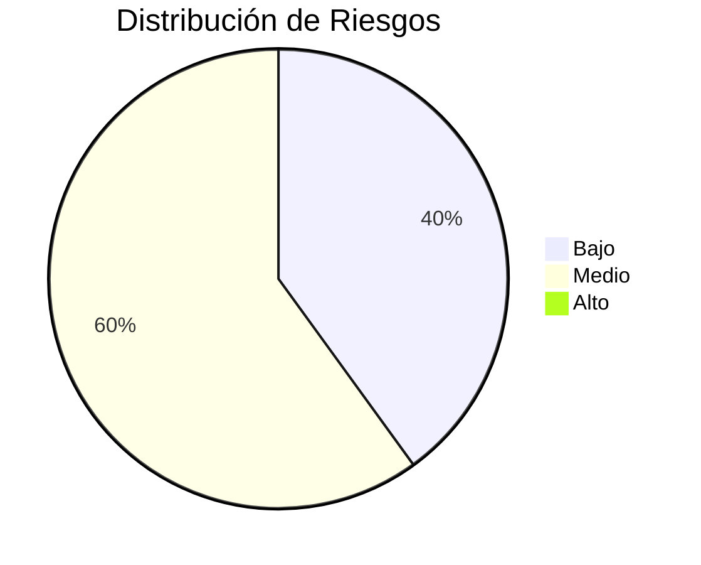
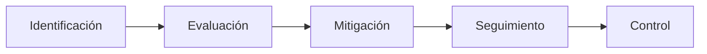

# ⚠️ Matriz General de Riesgos

## 📖 Introducción

Como parte del proceso de auditoría del proyecto **Tridente Store**, se realizó la identificación y evaluación de los riesgos asociados al desarrollo, implementación, mantenimiento y evolución del sistema.

La gestión de riesgos permite anticipar posibles eventos que podrían afectar la calidad del software, la disponibilidad del sistema, la seguridad de la información y la continuidad del servicio.

La evaluación considera la probabilidad de ocurrencia, el impacto potencial y las medidas de mitigación implementadas durante el desarrollo.

---

# 🎯 Objetivo

Identificar, evaluar y controlar los riesgos que podrían afectar el correcto funcionamiento y evolución del sistema Tridente Store.

---

# 📌 Metodología

La evaluación se realizó considerando los siguientes criterios:

| Criterio | Descripción |
|----------|-------------|
| Probabilidad | Posibilidad de que ocurra el riesgo |
| Impacto | Consecuencia sobre el proyecto |
| Nivel | Resultado del análisis Probabilidad × Impacto |
| Tratamiento | Acción para reducir el riesgo |

---

# 📊 Escala de Evaluación

| Probabilidad | Valor |
|--------------|------:|
| Baja | 1 |
| Media | 2 |
| Alta | 3 |

| Impacto | Valor |
|----------|------:|
| Bajo | 1 |
| Medio | 2 |
| Alto | 3 |

---

# 📈 Matriz de Riesgos

| Código | Riesgo | Probabilidad | Impacto | Nivel | Estado |
|---------|---------|-------------:|---------:|:------:|:------:|
| R-01 | Pérdida del código fuente | Baja | Alto | Medio | 🟡 |
| R-02 | Eliminación accidental de la base de datos | Baja | Alto | Medio | 🟡 |
| R-03 | Accesos no autorizados | Baja | Alto | Medio | 🟡 |
| R-04 | Dependencias desactualizadas | Media | Medio | Medio | 🟡 |
| R-05 | Errores de configuración | Baja | Medio | Bajo | 🟢 |
| R-06 | Baja cobertura de pruebas | Media | Medio | Medio | 🟡 |
| R-07 | Documentación desactualizada | Baja | Medio | Bajo | 🟢 |
| R-08 | Cambios sin registrar en Git | Baja | Medio | Bajo | 🟢 |
| R-09 | Vulnerabilidades en librerías | Baja | Alto | Medio | 🟡 |
| R-10 | Crecimiento del sistema | Media | Bajo | Bajo | 🟢 |

---

# 🛡 Controles Implementados

| Riesgo | Control Aplicado |
|---------|------------------|
| Código Fuente | GitHub |
| Seguridad | Laravel Authentication |
| Credenciales | Variables .env |
| Calidad | SonarCloud |
| Vulnerabilidades | Snyk |
| Base de Datos | Migraciones Laravel |
| Documentación | MKDocs |
| API | Swagger |

---

# 📉 Clasificación General

---

# 📊 Tratamiento de Riesgos

---

# 🚀 Estrategias de Mitigación

## Riesgos Tecnológicos

- Actualización periódica de dependencias.
- Revisión continua mediante SonarCloud.
- Escaneo de vulnerabilidades con Snyk.

---

## Riesgos Operativos

- Copias de seguridad.
- Versionamiento mediante Git.
- Documentación permanente.

---

## Riesgos de Seguridad

- Middleware.
- Roles.
- Autenticación.
- Variables de entorno.
- Protección de rutas.

---

## Riesgos Documentales

- Publicación mediante MKDocs.
- Actualización continua.
- Organización por módulos.

---

# 📈 Indicadores

| Indicador | Resultado |
|------------|-----------:|
| Riesgos Bajos | 40% |
| Riesgos Medios | 60% |
| Riesgos Altos | 0% |

---

# 🔍 Observaciones

La evaluación realizada evidencia que el proyecto mantiene un nivel de riesgo controlado.

No se identificaron riesgos críticos que comprometan el funcionamiento del sistema.

Las amenazas detectadas corresponden principalmente a actividades normales de mantenimiento y evolución del software.

---

# 💡 Recomendaciones

- Mantener actualizado Laravel.
- Ejecutar SonarCloud antes de cada versión.
- Ejecutar Snyk después de actualizar dependencias.
- Mantener respaldos de la base de datos.
- Actualizar permanentemente la documentación.
- Mantener un adecuado control de versiones.

---

!!! success "Resultado"

    La evaluación de riesgos evidencia que Tridente Store presenta un nivel de riesgo aceptable, contando con controles preventivos y correctivos que reducen significativamente la probabilidad de incidentes durante la operación y mantenimiento del sistema.