# 📷 Evidencias del Sistema

## 📌 Introducción

Esta sección presenta las principales interfaces desarrolladas para **Tridente Store**, evidenciando el funcionamiento de los módulos implementados durante el proyecto.

Las capturas muestran la evolución del sistema y permiten verificar visualmente cada funcionalidad.

---

# 🔐 Inicio de Sesión

!!! tip "Captura"

    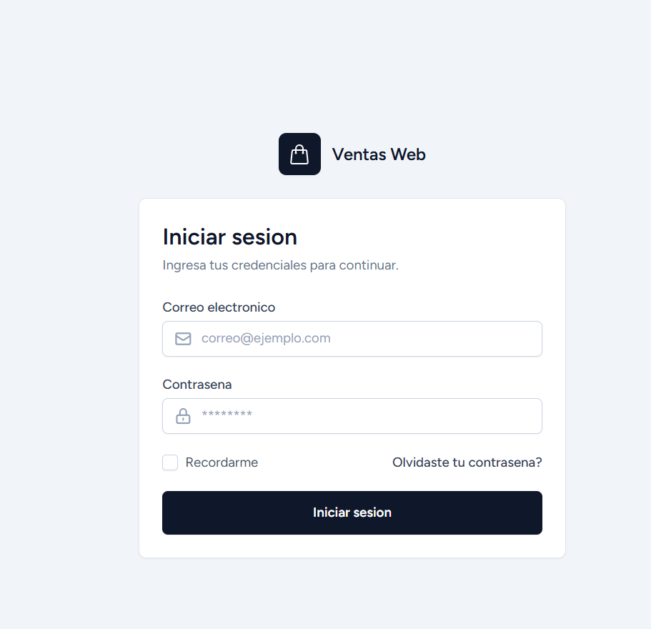

Descripción

- Autenticación de usuarios.
- Validación de credenciales.
- Acceso según rol.

---

# 🏠 Dashboard

!!! tip "Captura"

    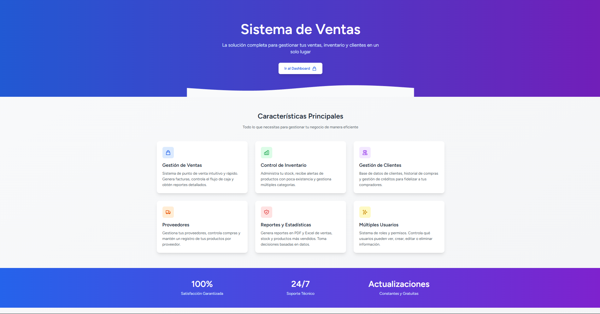

Descripción

- Indicadores.
- Accesos rápidos.
- Estadísticas.

---

# 👥 Gestión de Usuarios

!!! tip "Captura"

    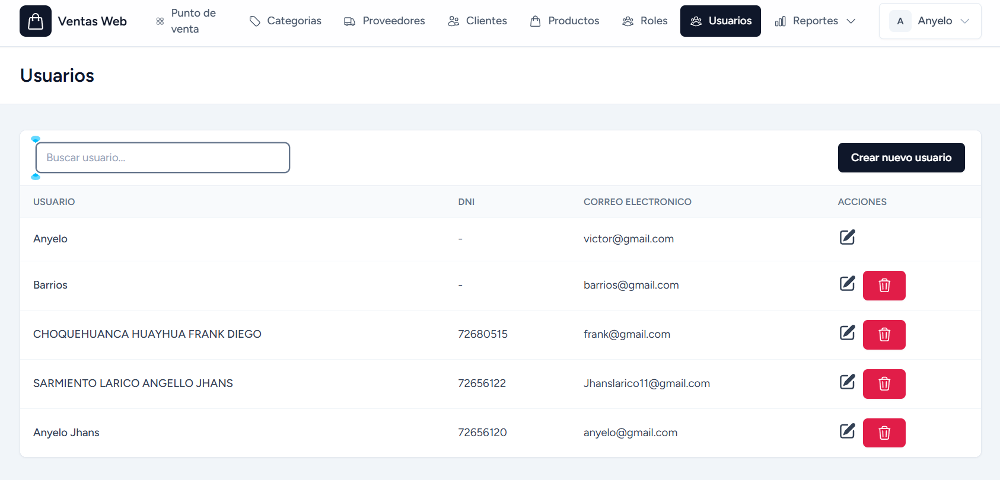

Funciones

- Registrar
- Editar
- Eliminar
- Roles

---

# 📦 Gestión de Productos

!!! tip "Captura"

    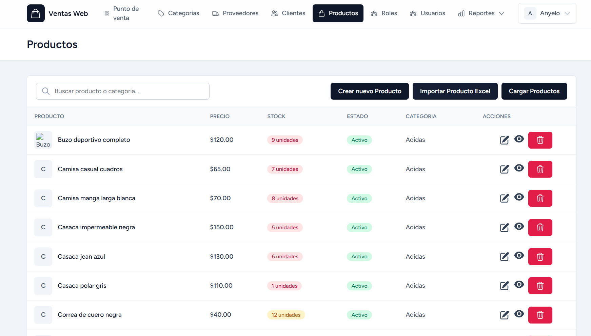

Funciones

- CRUD
- Stock
- Categorías

---

# 📂 Gestión de Categorías

!!! tip "Captura"

    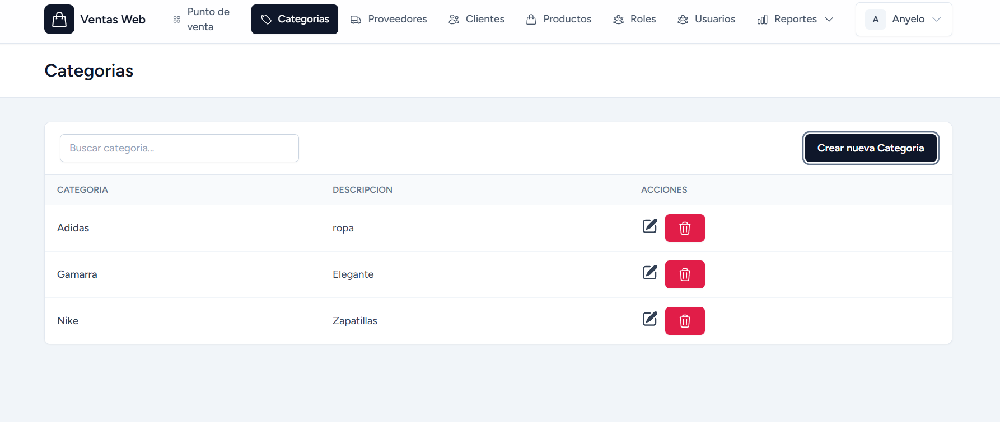

---

# 👤 Gestión de Clientes

!!! tip "Captura"

    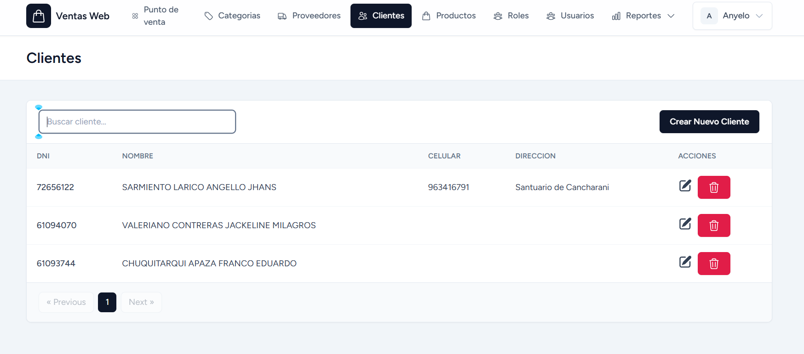

---

# 🚚 Gestión de Proveedores

!!! tip "Captura"

    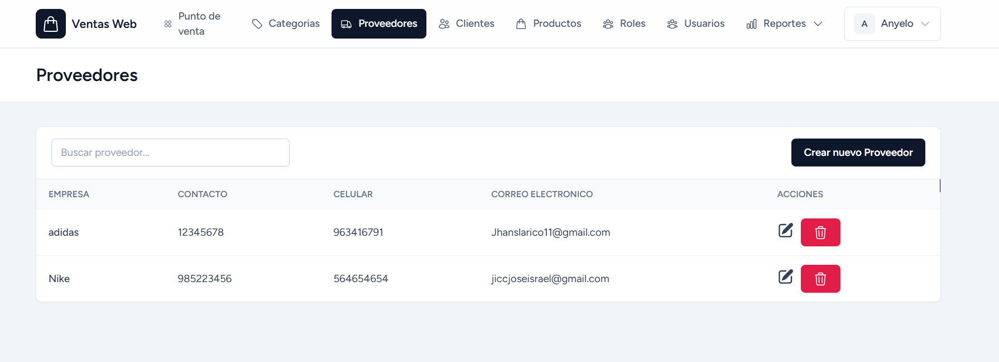

---

# 💳 Registro de Ventas

!!! tip "Captura"

    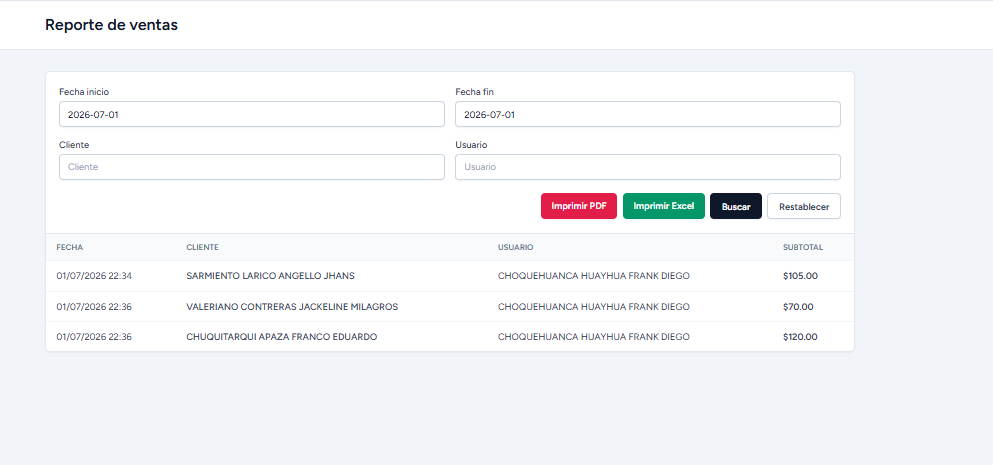

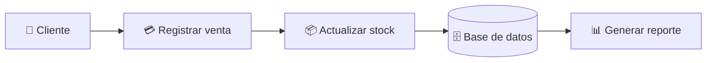

---

# 🛒 Registro de Compras

!!! tip "Captura"

    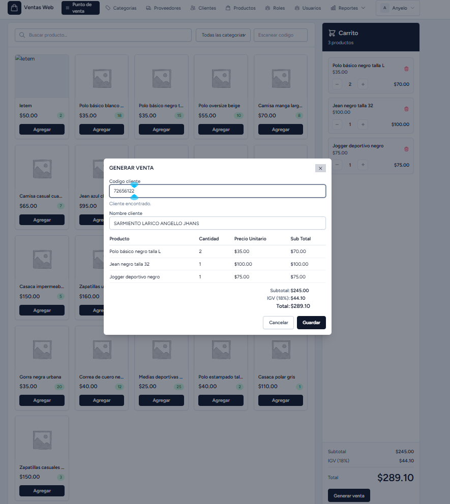

---

# 📊 Reportes

!!! tip "Captura"

    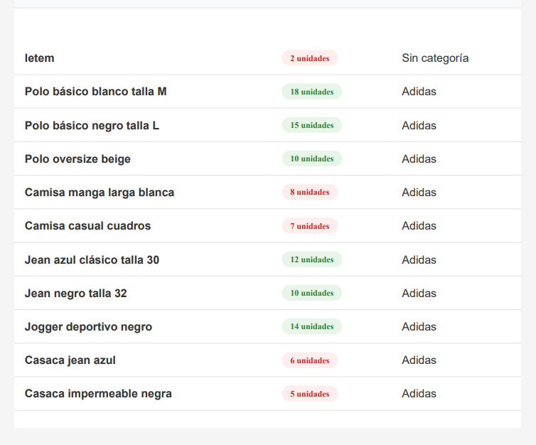

---

# 📖 Documentación MKDocs

!!! tip "Captura"

    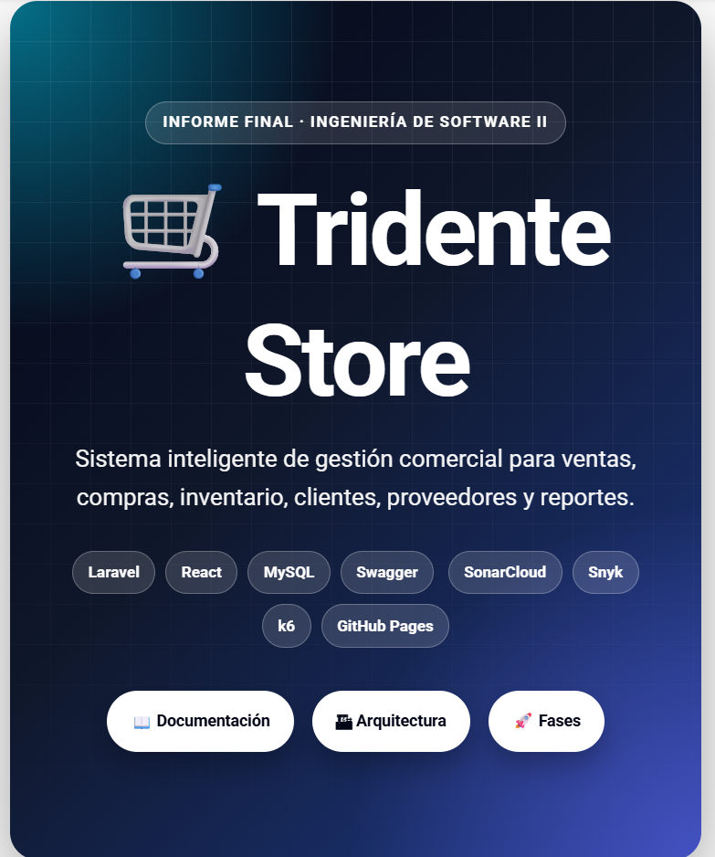

---

# 🚀 GitHub

!!! tip "Captura"

    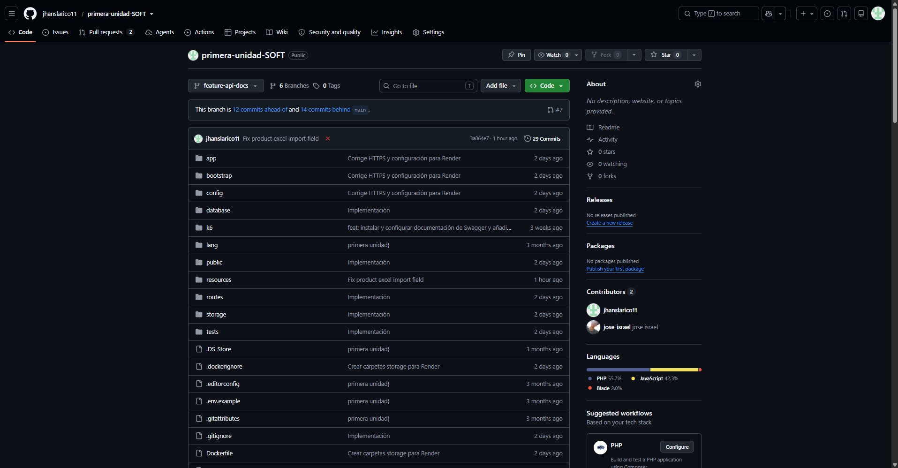

---

# 🧪 SonarCloud

!!! tip "Captura"

    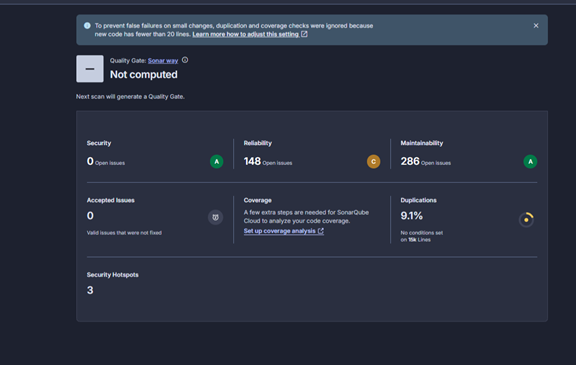

---

# 🔐 Snyk

!!! tip "Captura"

    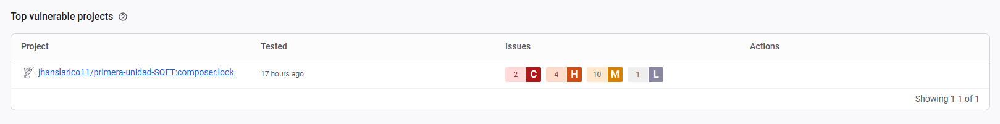

---

# ⚡ k6

!!! tip "Captura"

    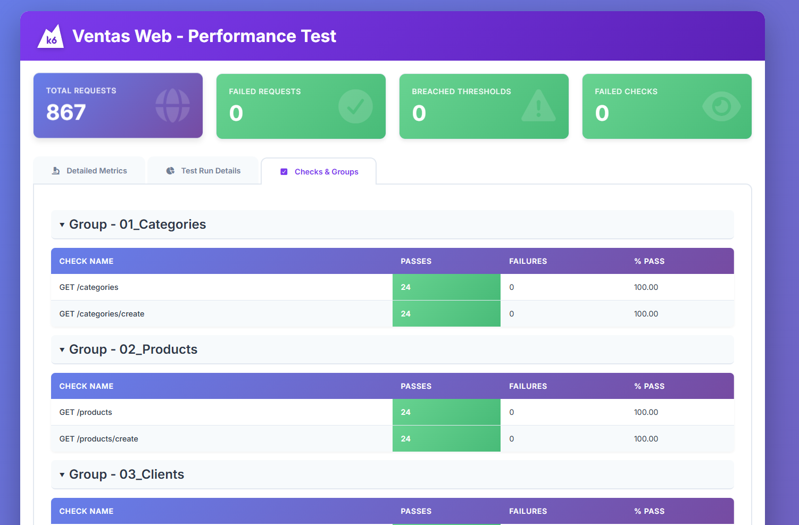

---

# 📋 Resumen de Evidencias

| Evidencia | Estado |
|------------|:------:|
| Login | ✅ |
| Dashboard | ✅ |
| Usuarios | ✅ |
| Productos | ✅ |
| Categorías | ✅ |
| Clientes | ✅ |
| Proveedores | ✅ |
| Ventas | ✅ |
| Compras | ✅ |
| Reportes | ✅ |
| GitHub | ✅ |
| SonarCloud | ✅ |
| Snyk | ✅ |
| MKDocs | ✅ |

---

!!! success "Resultado"

    Las evidencias presentadas demuestran la implementación y funcionamiento de los módulos principales de Tridente Store, así como el uso de herramientas de calidad, documentación y control de versiones.
