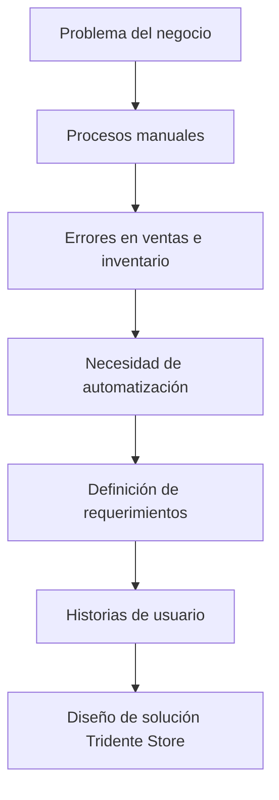

# 📋 Fase 1 - Análisis

## Objetivo de la fase

Identificar el problema del negocio, analizar las necesidades del usuario y definir los requerimientos funcionales y no funcionales del sistema **Tridente Store**.

---

## 🧩 Problema identificado

Muchos negocios presentan dificultades para gestionar sus operaciones comerciales debido al uso de métodos manuales o sistemas poco integrados. Esto genera errores en el control de ventas, inconsistencias en el inventario, pérdida de información y dificultades para tomar decisiones.

**Tridente Store** busca solucionar este problema mediante una plataforma que centraliza la gestión de ventas, compras, productos, clientes, proveedores, usuarios y reportes.

---

## 🎯 Necesidad del sistema

El negocio requiere un sistema que permita:

- Automatizar el registro de ventas.
- Controlar el inventario en tiempo real.
- Gestionar productos y categorías.
- Registrar clientes y proveedores.
- Controlar usuarios mediante roles y permisos.
- Generar reportes para la toma de decisiones.

---

## 🔍 Proceso AS-IS y TO-BE

| Modelo | Descripción |
|---|---|
| AS-IS | Representa el proceso actual, donde varias actividades se realizan de forma manual. |
| TO-BE | Representa el proceso futuro automatizado con el sistema Tridente Store. |

!!! info "Modelamiento BPMN"

    En esta fase se analiza el proceso actual y se propone un proceso mejorado mediante BPMN, permitiendo visualizar cómo el sistema reduce pasos manuales y mejora el control operativo.

---

## ✅ Requerimientos funcionales principales

| ID | Requerimiento | Prioridad |
|---|---|---|
| RF01 | Gestión de usuarios | Alta |
| RF02 | Control de acceso mediante login | Alta |
| RF03 | Roles y permisos | Alta |
| RF04 | Gestión de categorías | Alta |
| RF05 | Gestión de productos | Alta |
| RF06 | Control automático de stock | Alta |
| RF07 | Gestión de clientes | Alta |
| RF08 | Gestión de proveedores | Alta |
| RF09 | Registro de ventas | Alta |
| RF10 | Registro de compras | Alta |
| RF11 | Generación de reportes | Alta |
| RF12 | Consulta de productos disponibles | Media |
| RF13 | Historial de transacciones | Media |
| RF14 | Validación de datos | Alta |
| RF15 | Inventario en tiempo real | Alta |

---

## 👤 Historias de usuario destacadas

| ID | Historia de Usuario | Prioridad |
|---|---|---|
| HU01 | Como administrador, quiero registrar usuarios para controlar el acceso al sistema. | Alta |
| HU02 | Como administrador, quiero asignar roles y permisos para restringir funcionalidades. | Alta |
| HU03 | Como usuario, quiero iniciar sesión para acceder al sistema de forma segura. | Alta |
| HU04 | Como usuario, quiero registrar productos para mantener actualizado el inventario. | Alta |
| HU08 | Como usuario, quiero registrar clientes para asociarlos a las ventas. | Alta |
| HU10 | Como usuario, quiero registrar proveedores para gestionar compras. | Alta |
| HU11 | Como usuario, quiero registrar una venta para almacenar la transacción. | Alta |
| HU12 | Como usuario, quiero que el sistema actualice automáticamente el stock al vender. | Alta |
| HU16 | Como administrador, quiero generar reportes de ventas para analizar ingresos. | Alta |
| HU18 | Como administrador, quiero generar reportes de inventario para conocer el stock. | Alta |

---

## 🛡 Requerimientos no funcionales

| ID | Requerimiento | Descripción | Prioridad |
|---|---|---|---|
| RNF01 | Rendimiento | El sistema debe responder en menos de 3 segundos. | Alta |
| RNF02 | Seguridad | El sistema debe proteger el acceso mediante autenticación. | Alta |
| RNF03 | Control de acceso | Restringir funcionalidades según rol de usuario. | Alta |
| RNF04 | Usabilidad | La interfaz debe ser intuitiva y fácil de usar. | Alta |
| RNF05 | Disponibilidad | El sistema debe estar disponible para su uso continuo. | Media |
| RNF06 | Escalabilidad | Debe soportar múltiples usuarios simultáneamente. | Media |
| RNF07 | Mantenibilidad | El código debe estar estructurado y documentado. | Alta |
| RNF08 | Compatibilidad | Debe funcionar en navegadores modernos. | Alta |
| RNF09 | Integridad de datos | Debe garantizar información consistente y confiable. | Alta |
| RNF10 | Portabilidad | Debe poder ejecutarse en diferentes entornos. | Media |

---

## 📦 Entregables de la fase

<h3>📄 Documento de requerimientos</h3>

Definición de requerimientos funcionales y no funcionales del sistema.

<h3>👤 Historias de usuario</h3>

Necesidades del usuario expresadas desde la perspectiva del cliente y administrador.

<h3>🔄 BPMN AS-IS</h3>

Representación del proceso actual antes de implementar el sistema.

<h3>🚀 BPMN TO-BE</h3>

Representación del proceso optimizado mediante Tridente Store.

---

## 📊 Diagrama de análisis

---

## ✅ Resultado de la fase

La fase de análisis permitió definir claramente las necesidades del sistema, los requerimientos principales, las historias de usuario y los procesos que deben ser automatizados. Esta información sirve como base para la fase de diseño del sistema.