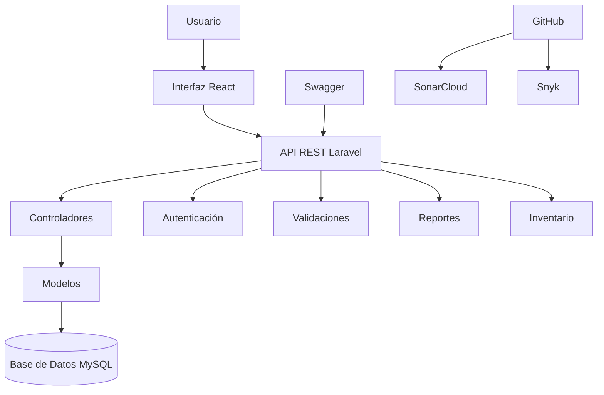
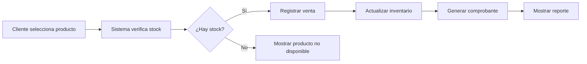

# 🏗 Fase 2 - Diseño

## Objetivo de la fase

Diseñar la estructura técnica del sistema **Tridente Store**, definiendo su arquitectura, componentes principales, flujo de información, base de datos y organización de módulos.

---

## 🧠 Enfoque de diseño

El sistema se diseñó bajo una arquitectura **cliente-servidor**, separando la interfaz de usuario, la lógica de negocio y la persistencia de datos.

Esta separación permite mejorar:

- Escalabilidad.
- Mantenibilidad.
- Seguridad.
- Rendimiento.
- Organización del código.
- Facilidad de despliegue.

---

## 🏛 Arquitectura propuesta

| Capa | Tecnología | Función |
|---|---|---|
| Frontend | React | Interfaz de usuario |
| Backend | Laravel | Lógica de negocio y API |
| Base de datos | MySQL / SQLite | Almacenamiento de información |
| Documentación API | Swagger | Documentación de endpoints |
| Control de versiones | GitHub | Gestión colaborativa del código |
| Calidad | SonarCloud / Snyk | Revisión de calidad y seguridad |

---

## 🧩 Componentes principales

<h3>Frontend React</h3>

Permite al usuario interactuar con el sistema mediante interfaces dinámicas y responsivas.

<h3>Backend Laravel</h3>

Gestiona la lógica de negocio, validaciones, autenticación, API REST y comunicación con la base de datos.

<h3>Base de Datos</h3>

Almacena usuarios, productos, categorías, clientes, proveedores, ventas, compras e inventario.

<h3>API REST</h3>

Permite la comunicación entre frontend y backend mediante endpoints documentados con Swagger.

---

## 🔐 Diseño de seguridad

El diseño del sistema considera autenticación, autorización y protección de datos mediante:

- Login de usuarios.
- Roles y permisos.
- Validación de formularios.
- Restricción de acceso por perfil.
- Uso de variables de entorno.
- Protección de credenciales sensibles.
- Revisión de vulnerabilidades con Snyk.
- Análisis de seguridad con SonarCloud.

---

## 🗃 Entidades principales del sistema

| Entidad | Descripción |
|---|---|
| Usuario | Persona con acceso al sistema |
| Rol | Define permisos y nivel de acceso |
| Producto | Artículo disponible para venta |
| Categoría | Clasificación de productos |
| Cliente | Persona que realiza compras |
| Proveedor | Entidad que abastece productos |
| Venta | Transacción comercial de salida |
| Compra | Transacción de ingreso de productos |
| Inventario | Control de stock disponible |
| Reporte | Información generada para análisis |

---

## 🔄 Diagrama de arquitectura

---

## 🧭 Flujo de venta diseñado

---

## 📦 Entregables de la fase

<h3>🏛 Arquitectura del sistema</h3>

Diseño general cliente-servidor con frontend, backend y base de datos.

<h3>🗃 Modelo de datos</h3>

Identificación de entidades principales y relaciones del sistema.

<h3>🔐 Diseño de seguridad</h3>

Definición de roles, permisos, autenticación y protección de credenciales.

<h3>🔄 Flujo del sistema</h3>

Diseño del proceso de venta e inventario automatizado.

---

## ✅ Resultado de la fase

La fase de diseño permitió definir la estructura técnica de **Tridente Store**, estableciendo una arquitectura clara basada en React, Laravel y base de datos relacional. Además, se diseñaron los módulos principales, el flujo de venta, la seguridad y los componentes necesarios para la implementación.