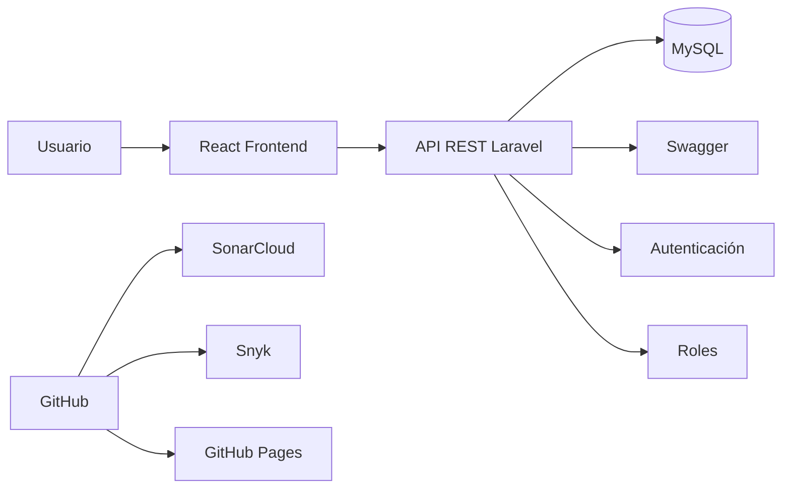
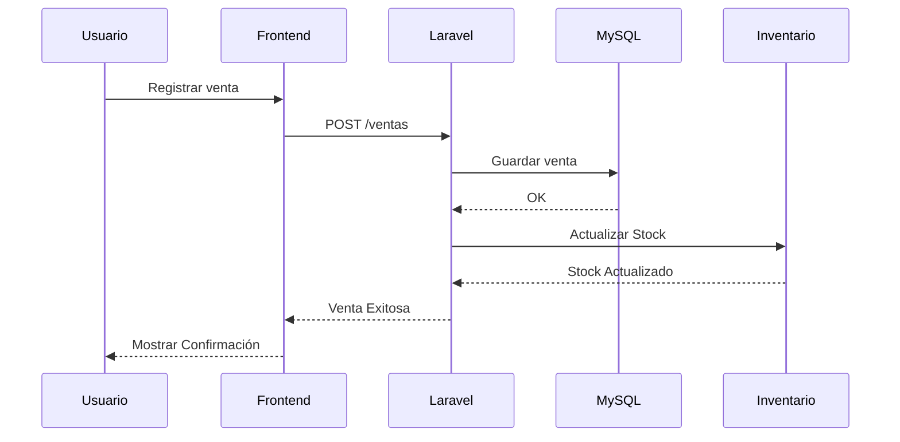

# 💻 Fase 3 - Desarrollo

## Objetivo

Implementar los módulos del sistema Tridente Store utilizando una arquitectura moderna basada en Laravel, React y MySQL, siguiendo buenas prácticas de Ingeniería de Software.

---

# 🏗 Arquitectura de Implementación

Durante esta fase se desarrolló el sistema bajo una arquitectura Cliente - Servidor.



---

# ⚙ Stack Tecnológico

| Tecnología | Función |
|------------|----------|
| Laravel 12 | Backend |
| React | Frontend |
| MySQL | Base de Datos |
| Tailwind CSS | Diseño UI |
| Swagger | Documentación API |
| GitHub | Versionamiento |
| Jira | Gestión Scrum |
| SonarCloud | Calidad |
| Snyk | Seguridad |
| k6 | Rendimiento |
| MKDocs | Documentación |

---

# 📦 Módulos implementados

<div class="cards">

<div class="card">

## 👤 Usuarios

- CRUD Usuarios
- Login
- Logout
- Roles
- Permisos

</div>

<div class="card">

## 📦 Productos

- CRUD Productos
- Categorías
- Stock

</div>

<div class="card">

## 💳 Ventas

- Registro
- Detalle
- Actualización de Stock

</div>

<div class="card">

## 🛒 Compras

- Registro
- Proveedores

</div>

<div class="card">

## 📊 Reportes

- Ventas
- Compras
- Inventario

</div>

<div class="card">

## 🔐 Seguridad

- Middleware
- Policies
- Validaciones

</div>

</div>

---

# 🔄 Flujo de una venta



---

# 📁 Organización del Proyecto

```text
app/

Controllers/

Models/

Services/

Repositories/

Policies/

Middleware/

resources/

views/

components/

routes/

api.php

web.php

database/

migrations/

seeders/
```

---

# 🔐 Seguridad implementada

✅ Login

✅ Hash de Contraseñas

✅ Roles

✅ Permisos

✅ Validaciones

✅ Protección CSRF

✅ Middleware

---

# 📊 Gestión del Código

Durante el desarrollo se utilizaron herramientas de apoyo para garantizar calidad y organización.

| Herramienta | Uso |
|------------|------|
| GitHub | Control de versiones |
| Jira | Sprint Backlog |
| SonarCloud | Calidad |
| Snyk | Vulnerabilidades |
| Swagger | API |

---

# 📦 Entregables

<div class="cards">

<div class="card">
<h3>💻 Código Fuente</h3>
<p>Repositorio GitHub con el código fuente del proyecto.</p>
</div>

<div class="card">
<h3>📚 API REST</h3>
<p>Documentación de la API utilizando Swagger.</p>
</div>

<div class="card">
<h3>🖥 Frontend</h3>
<p>Aplicación desarrollada con React.</p>
</div>

<div class="card">
<h3>⚙ Backend</h3>
<p>Servicios y lógica de negocio desarrollados en Laravel.</p>
</div>

<div class="card">
<h3>🗄 Base de Datos</h3>
<p>Modelo relacional implementado en MySQL.</p>
</div>

<div class="card">
<h3>📸 Evidencias</h3>
<p>Capturas del sistema y pruebas de funcionamiento.</p>
</div>

</div>

---

# ✅ Resultado

La fase de desarrollo permitió implementar todos los módulos funcionales del sistema Tridente Store, integrando una arquitectura moderna basada en Laravel y React, con mecanismos de autenticación, gestión de inventario, ventas, compras y reportes, además de incorporar herramientas de calidad, seguridad y documentación.