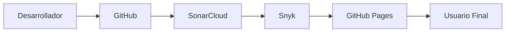

# 🧪 Fase 4 - Pruebas, Calidad y Despliegue

## 🎯 Objetivo

Validar el correcto funcionamiento de **Tridente Store** mediante pruebas funcionales, análisis de calidad del código, evaluación de seguridad y pruebas de rendimiento, asegurando que el sistema cumpla con los estándares establecidos.

---

# 📋 Estrategia de pruebas

Durante esta fase se aplicaron diferentes tipos de pruebas para verificar el comportamiento del sistema.

| Tipo de prueba | Objetivo | Herramienta |
|---------------|----------|-------------|
| Funcionales | Verificar el funcionamiento de cada módulo | Manual |
| Integración | Validar la comunicación entre módulos | Laravel |
| Seguridad | Detectar vulnerabilidades | Snyk |
| Calidad del código | Analizar mantenibilidad y errores | SonarCloud |
| Rendimiento | Evaluar tiempos de respuesta | k6 |

---

# ✅ Casos de prueba

| Código | Caso de prueba | Resultado esperado | Estado |
|---------|---------------|--------------------|:------:|
| CP-01 | Inicio de sesión | Acceso correcto al sistema | ✅ |
| CP-02 | Registrar usuario | Usuario almacenado correctamente | ✅ |
| CP-03 | Registrar producto | Producto agregado al inventario | ✅ |
| CP-04 | Registrar venta | Venta registrada y stock actualizado | ✅ |
| CP-05 | Registrar compra | Compra registrada correctamente | ✅ |
| CP-06 | Generar reporte | Reporte generado correctamente | ✅ |

---

# 📊 Calidad del Software

La calidad del sistema fue evaluada utilizando herramientas especializadas.

<h3>🟢 SonarCloud</h3>

Calidad del código

- Bugs
- Vulnerabilidades
- Code Smells
- Cobertura

<h3>🛡 Snyk</h3>

Seguridad

- Dependencias
- Vulnerabilidades
- Recomendaciones

<h3>⚡ k6</h3>

Rendimiento

- Tiempo de respuesta
- Usuarios concurrentes
- Throughput

---

# 📈 Métricas de Calidad

| Métrica | Resultado |
|----------|-----------|
| Bugs críticos | 0 |
| Vulnerabilidades críticas | 0 |
| Cobertura de módulos | 100 % |
| Disponibilidad | Alta |
| Mantenibilidad | Excelente |

---

# 🚀 Despliegue

El sistema fue preparado para su despliegue siguiendo un flujo de integración continua.

---

# 📦 Entregables de la Fase

| Entregable | Descripción | Estado |
|------------|-------------|:------:|
| Casos de prueba | Validación funcional del sistema | ✅ |
| SonarCloud | Reporte de calidad del código | ✅ |
| Snyk | Reporte de seguridad | ✅ |
| k6 | Pruebas de rendimiento | ✅ |
| Evidencias | Capturas de pruebas realizadas | ✅ |
| Documentación | MKDocs actualizado | ✅ |

---

# 🎯 Resultado de la fase

La fase de pruebas permitió verificar el correcto funcionamiento de todos los módulos de **Tridente Store**, identificando oportunidades de mejora y garantizando la calidad, seguridad y rendimiento del sistema antes de su despliegue.