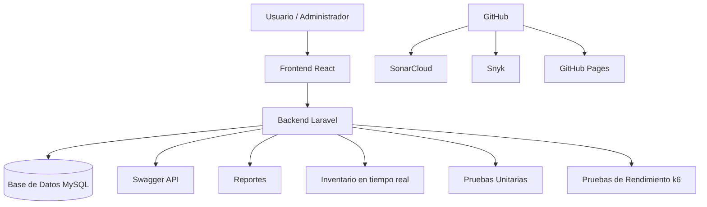
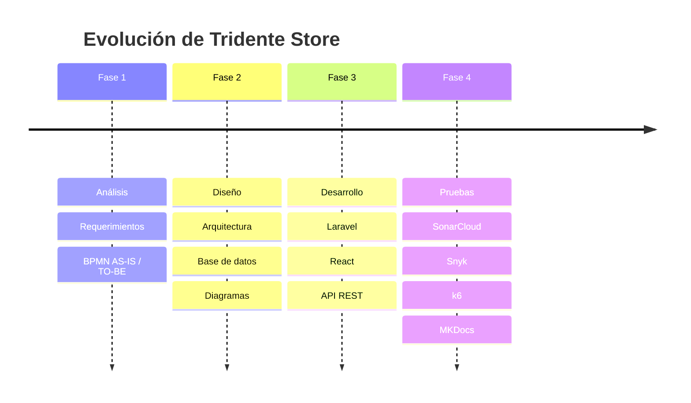

  
Informe Final · Ingeniería de Software II

  <h1>🛒 Tridente Store</h1>
  
Sistema inteligente de gestión comercial para ventas, compras, inventario, clientes, proveedores y reportes.

  

    LaravelReactMySQLSwagger
    SonarCloudSnykk6GitHub Pages
  

  

    <a href="proyecto/descripcion/">📖 Documentación</a>
    <a href="arquitectura/arquitectura-general/">🏗 Arquitectura</a>
    <a href="fases/fase1-analisis/">🚀 Fases</a>
  

## 📊 Dashboard Ejecutivo

<h2>15+</h2>
Requerimientos funcionales

<h2>20</h2>
Historias de usuario

<h2>5</h2>
Sprints Scrum

<h2>4</h2>
Fases principales

---

## 🧩 Módulos del Sistema

<h3>🔐 Seguridad</h3>
Login, roles, permisos y control de acceso.

<h3>📦 Inventario</h3>
Productos, categorías y stock en tiempo real.

<h3>💳 Ventas</h3>
Registro de ventas y actualización automática del stock.

<h3>🛒 Compras</h3>
Ingreso de productos y gestión de proveedores.

<h3>👥 Clientes</h3>
Administración de clientes y trazabilidad comercial.

<h3>📊 Reportes</h3>
Reportes de ventas, compras e inventario.

<h3>🧪 Calidad</h3>
SonarCloud, Snyk, ISO 25010 y k6.

<h3>📚 Documentación</h3>
MKDocs, Swagger, manual técnico y evidencias.

---

## 🏗 Arquitectura General

---

## 📈 Roadmap del Proyecto

---

## 🧪 Calidad y Buenas Prácticas

| Herramienta / Norma | Aplicación |
|---|---|
| ISO/IEC 12207 | Ciclo de vida del software |
| ISO/IEC 25010 | Calidad del producto |
| Scrum | Sprints y entregas incrementales |
| CMMI | Mejora de procesos |
| Jira | Backlog y planificación |
| GitHub | Control de versiones |
| Swagger | Documentación de API |
| SonarCloud | Calidad del código |
| Snyk | Seguridad |
| k6 | Rendimiento |

---

## ✅ Entregables principales

| Requisito del docente | Evidencia en la documentación |
|---|---|
| MKDocs | Sitio web documental |
| 4 fases | Análisis, diseño, desarrollo y pruebas |
| Entregables por fase | Tablas y secciones por fase |
| Autoauditoría | Checklist de cumplimiento |
| Comparación con arquitectura | Arquitectura diseñada vs implementada |

!!! success "Objetivo"

    Esta documentación está diseñada para destacar visualmente y demostrar un nivel profesional en Ingeniería de Software.