# 🛠 Manual Técnico

## 📌 Introducción

El presente manual técnico describe la estructura, configuración, instalación, ejecución y mantenimiento del sistema **Tridente Store**, desarrollado como una aplicación web para la gestión comercial.

Está dirigido a desarrolladores, administradores del sistema y personal técnico responsable de la instalación y mantenimiento.

---

# 📋 Requisitos del sistema

## Hardware recomendado

| Recurso | Recomendado |
|----------|-------------|
| Procesador | Intel Core i5 o superior |
| Memoria RAM | 8 GB o más |
| Almacenamiento | 10 GB libres |
| Conexión | Internet para dependencias |

---

## Software requerido

| Software | Versión |
|----------|----------|
| PHP | 8.2+ |
| Composer | Última versión |
| Node.js | 20+ |
| npm | Última versión |
| Laravel | 12 |
| React | 19 |
| MySQL | 8+ |
| Git | Última versión |
| Visual Studio Code | Recomendado |

---

# 📁 Estructura del proyecto

```text
tridente-store/

├── app/
├── bootstrap/
├── config/
├── database/
├── public/
├── resources/
├── routes/
├── storage/
├── tests/
├── vendor/
├── package.json
├── composer.json
└── .env
```

---

# ⚙ Instalación

## 1. Clonar el repositorio

```bash
git clone https://github.com/usuario/tridente-store.git
```

## 2. Entrar al proyecto

```bash
cd tridente-store
```

## 3. Instalar dependencias PHP

```bash
composer install
```

## 4. Instalar dependencias JavaScript

```bash
npm install
```

## 5. Copiar variables de entorno

```bash
cp .env.example .env
```

## 6. Generar la clave de Laravel

```bash
php artisan key:generate
```

## 7. Ejecutar migraciones

```bash
php artisan migrate
```

## 8. Ejecutar seeders (si existen)

```bash
php artisan db:seed
```

---

# ▶ Ejecución del proyecto

## Backend

```bash
php artisan serve
```

## Frontend

```bash
npm run dev
```

---

# 🗄 Configuración de la Base de Datos

Editar el archivo `.env`:

```env
DB_CONNECTION=mysql
DB_HOST=127.0.0.1
DB_PORT=3306
DB_DATABASE=tridente_store
DB_USERNAME=root
DB_PASSWORD=
```

---

# 📡 Documentación API

La API REST se encuentra documentada mediante Swagger.

Principales módulos:

- Usuarios
- Roles
- Productos
- Categorías
- Clientes
- Proveedores
- Ventas
- Compras
- Reportes

---

# 🧪 Pruebas

Durante el desarrollo se realizaron pruebas para verificar el correcto funcionamiento del sistema.

| Tipo de prueba | Herramienta |
|---------------|-------------|
| Funcionales | Manual |
| Calidad | SonarCloud |
| Seguridad | Snyk |
| Rendimiento | k6 |

---

# 🔄 Control de versiones

El proyecto utiliza **Git** como sistema de control de versiones y **GitHub** como repositorio remoto para gestionar el código fuente, facilitar la colaboración y mantener un historial de cambios.

## Flujo de trabajo

```mermaid
flowchart LR
    A[👨‍💻 Desarrollador] --> B[📂 Clonar repositorio]
    B --> C[🌿 Crear o cambiar de rama]
    C --> D[💻 Desarrollar funcionalidades]
    D --> E[✅ Git Add]
    E --> F[📝 Git Commit]
    F --> G[⬆️ Git Push]
    G --> H[🐙 GitHub]
    H --> I[🔀 Pull Request]
    I --> J[👀 Revisión de código]
    J --> K[✔️ Merge a main]
    K --> L[🚀 Despliegue]
```



---

# 🚀 Despliegue

La documentación técnica fue publicada utilizando:

- GitHub Pages
- Material for MKDocs

El código fuente puede desplegarse en cualquier servidor compatible con PHP y MySQL.

---

# 📚 Mantenimiento

Se recomienda:

- Actualizar dependencias periódicamente.
- Revisar vulnerabilidades con Snyk.
- Analizar calidad con SonarCloud.
- Respaldar la base de datos.
- Mantener la documentación actualizada.

---

!!! success "Conclusión"

    El manual técnico proporciona la información necesaria para instalar, configurar, ejecutar y mantener Tridente Store, facilitando futuras actualizaciones y el trabajo colaborativo del equipo de desarrollo.