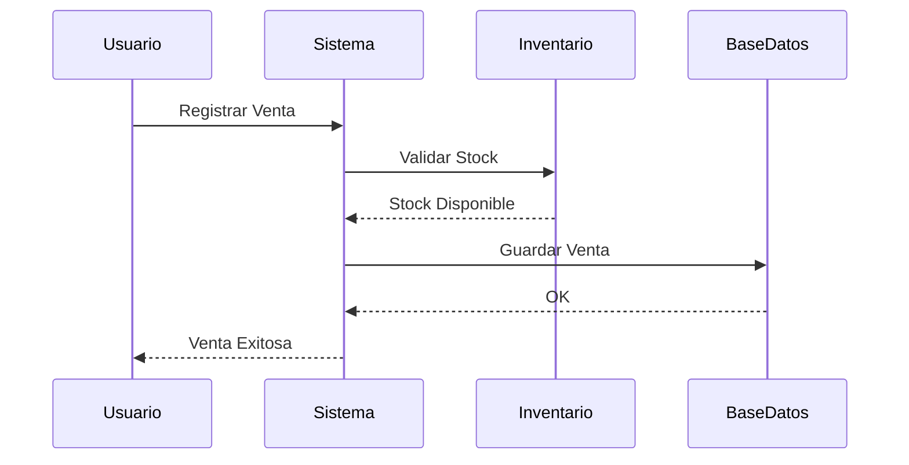
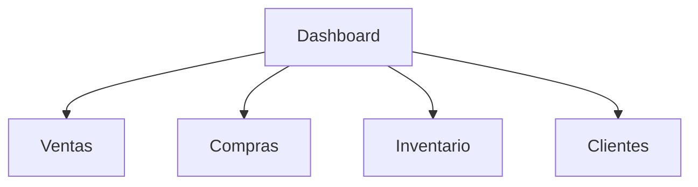

# 👤 Manual de Usuario

## 📌 Introducción

El presente manual describe el funcionamiento del sistema **Tridente Store**, explicando el uso de cada uno de los módulos principales para facilitar las operaciones diarias de los usuarios.

Está dirigido a administradores, vendedores y demás usuarios autorizados.

---

# 🔐 Inicio de Sesión

## Objetivo

Permitir el acceso seguro al sistema mediante credenciales de usuario.

### Procedimiento

1. Abrir el navegador web.
2. Ingresar la dirección del sistema.
3. Escribir usuario y contraseña.
4. Presionar **Iniciar Sesión**.

!!! tip "Captura"

    

---

# 🏠 Dashboard Principal

Después del inicio de sesión el usuario visualizará el panel principal con acceso a todos los módulos disponibles según su rol.

### Funciones

- Acceso rápido
- Indicadores
- Menú lateral
- Reportes

!!! tip "Captura"

    

---

# 👥 Gestión de Usuarios

Permite administrar los usuarios del sistema.

### Funciones

- Registrar usuario
- Editar usuario
- Eliminar usuario
- Asignar rol

### Flujo

```mermaid
flowchart LR

Administrador

-->

Formulario

-->

Guardar

-->

Base de Datos

-->

Listado
```

!!! tip "Captura"

    

---

# 📦 Gestión de Productos

Permite administrar el inventario.

### Funciones

- Registrar productos
- Editar productos
- Eliminar productos
- Consultar stock

```mermaid
flowchart TD

Producto

-->

Registrar

-->

Guardar

-->

Actualizar Inventario
```

!!! tip "Captura"

    

---

# 🗂 Gestión de Categorías

Funciones:

- Registrar categoría
- Modificar categoría
- Eliminar categoría

!!! tip "Captura"

    

---

# 👤 Gestión de Clientes

Permite registrar clientes para asociarlos a las ventas.

Funciones

- Registrar
- Buscar
- Editar
- Eliminar

!!! tip "Captura"

    

---

# 🚚 Gestión de Proveedores

Permite administrar los proveedores.

Funciones

- Registrar
- Modificar
- Eliminar

!!! tip "Captura"

    

---

# 💳 Registro de Ventas

El usuario podrá registrar ventas de manera rápida.

## Flujo



!!! tip "Captura"

    

---

# 🛒 Registro de Compras

Permite ingresar productos al inventario.

### Funciones

- Registrar compra
- Actualizar stock

!!! tip "Captura"

    

---

# 📊 Reportes

El sistema permite consultar diferentes reportes.

- Ventas
- Compras
- Productos
- Inventario



!!! tip "Captura"

    

---

# ⚙ Configuración

Dependiendo del rol, el usuario podrá acceder a:

- Perfil
- Cambio de contraseña
- Configuración del sistema

---

# ❓ Preguntas Frecuentes

## No puedo iniciar sesión

Verifique que el usuario y contraseña sean correctos.

---

## No puedo registrar una venta

Compruebe que exista stock disponible y que los datos obligatorios estén completos.

---

## No aparecen los reportes

Revise que tenga permisos suficientes para acceder a este módulo.

---

# 📞 Soporte

En caso de inconvenientes técnicos, comuníquese con el administrador del sistema o con el equipo de desarrollo.

---

!!! success "Conclusión"

    El Manual de Usuario proporciona una guía clara para utilizar cada módulo de Tridente Store, facilitando el aprendizaje del sistema y reduciendo errores durante su operación.
