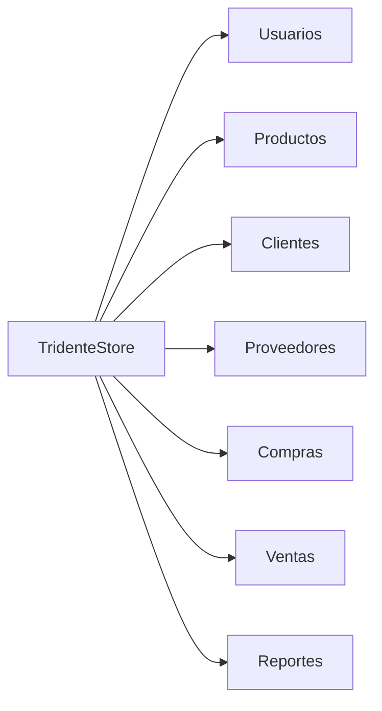

# 📍 Alcance del Proyecto

## Alcance Funcional

El sistema permite administrar los procesos comerciales mediante los siguientes módulos:

- Gestión de usuarios.
- Gestión de roles.
- Gestión de productos.
- Gestión de categorías.
- Gestión de clientes.
- Gestión de proveedores.
- Gestión de ventas.
- Gestión de compras.
- Reportes.

---

# Alcance Técnico

El proyecto contempla:

- Frontend desarrollado en React.
- Backend desarrollado en Laravel.
- Base de datos MySQL.
- API REST.
- Swagger.
- GitHub.
- SonarCloud.
- Snyk.
- MKDocs.

---

# Alcance de Calidad

El sistema fue evaluado mediante:

- ISO/IEC 25010.
- SonarCloud.
- Snyk.
- k6.

---

# Diagrama del Alcance

---

!!! success "Resultado"

El alcance del proyecto comprende la automatización integral de los procesos comerciales de una organización mediante una solución web moderna y escalable.