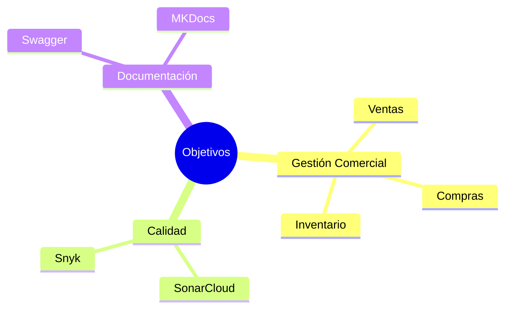

# 🎯 Objetivos

# Objetivo General

Desarrollar un sistema web denominado **Tridente Store** que permita gestionar eficientemente los procesos comerciales relacionados con ventas, compras, inventario, clientes, proveedores y reportes, utilizando tecnologías modernas y buenas prácticas de Ingeniería de Software.

---

# Objetivos Específicos

- Automatizar el registro de ventas y compras.
- Administrar productos y categorías.
- Gestionar clientes y proveedores.
- Implementar autenticación y control de acceso mediante roles.
- Mantener actualizado el inventario.
- Generar reportes para apoyar la toma de decisiones.
- Implementar una API REST documentada con Swagger.
- Aplicar herramientas de calidad y seguridad como SonarCloud y Snyk.
- Elaborar una documentación técnica utilizando MKDocs.

---

# Relación con el Proyecto

