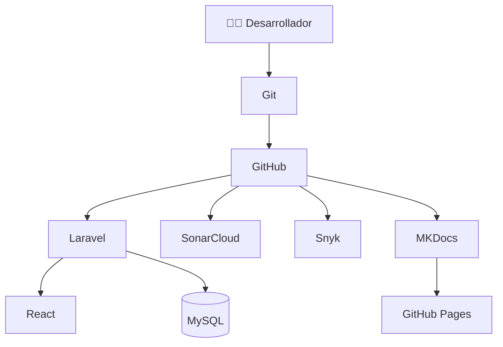

# ⚙️ Stack Tecnológico

## Tecnologías utilizadas

| Tecnología | Función |
|-------------|----------|
| Laravel 12 | Backend |
| React | Frontend |
| MySQL | Base de Datos |
| Tailwind CSS | Interfaz |
| Swagger | Documentación API |
| Git | Control de versiones |
| GitHub | Repositorio |
| SonarCloud | Calidad |
| Snyk | Seguridad |
| k6 | Rendimiento |
| MKDocs | Documentación |

---

# Arquitectura Tecnológica

---

# Herramientas Complementarias

| Herramienta | Uso |
|-------------|-----|
| VS Code | Desarrollo |
| Composer | Dependencias PHP |
| npm | Dependencias JavaScript |
| Postman | Pruebas API |
| Swagger | Documentación |
| GitHub Pages | Publicación |
| Mermaid | Diagramas |

---

!!! success "Conclusión"

La combinación de estas tecnologías permitió desarrollar una solución moderna, escalable, segura y bien documentada.